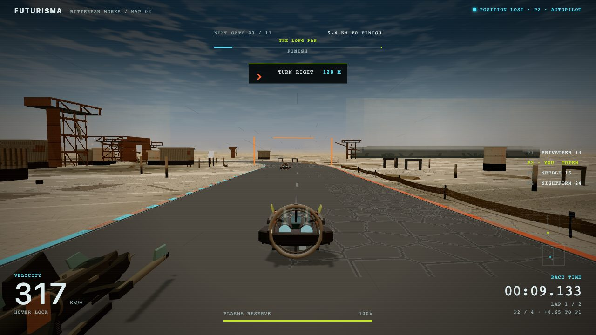
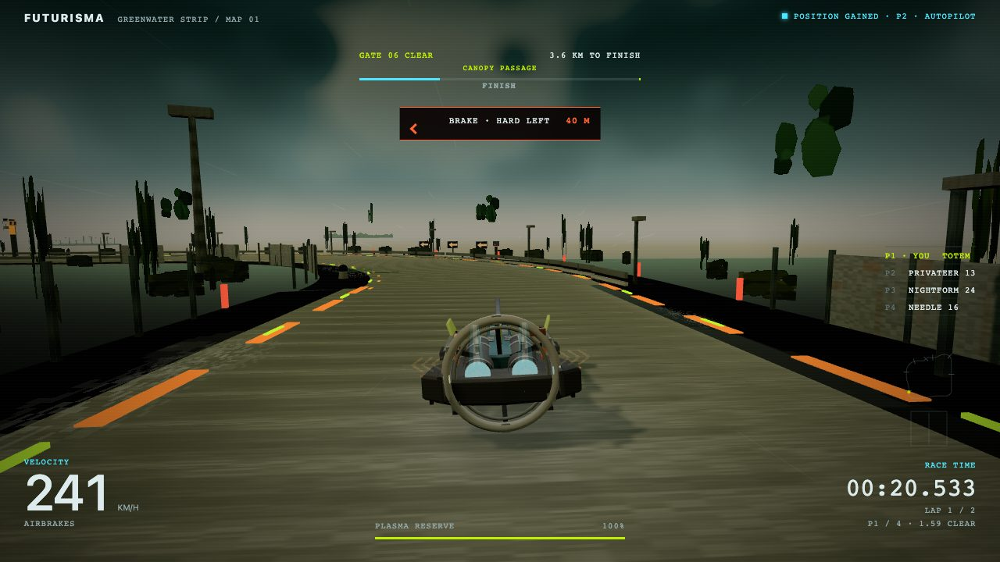
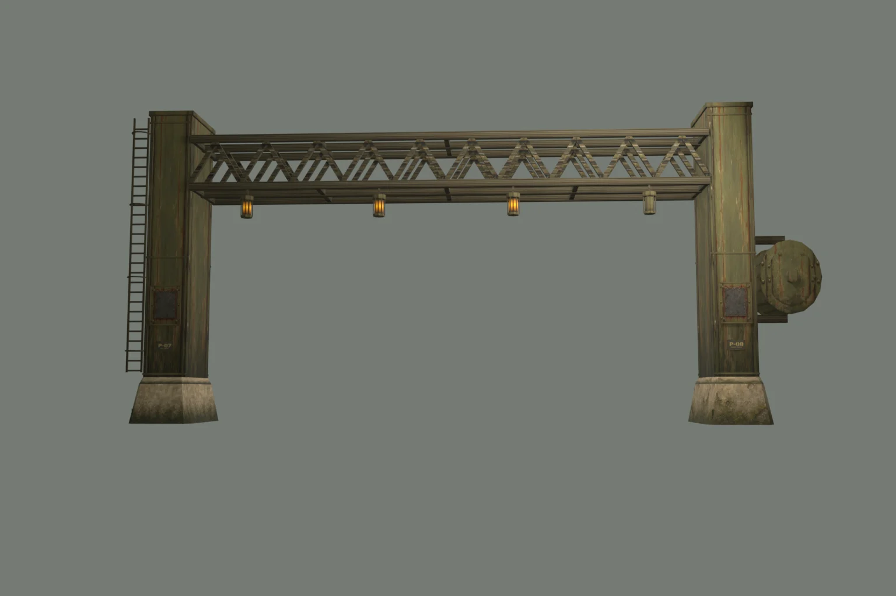
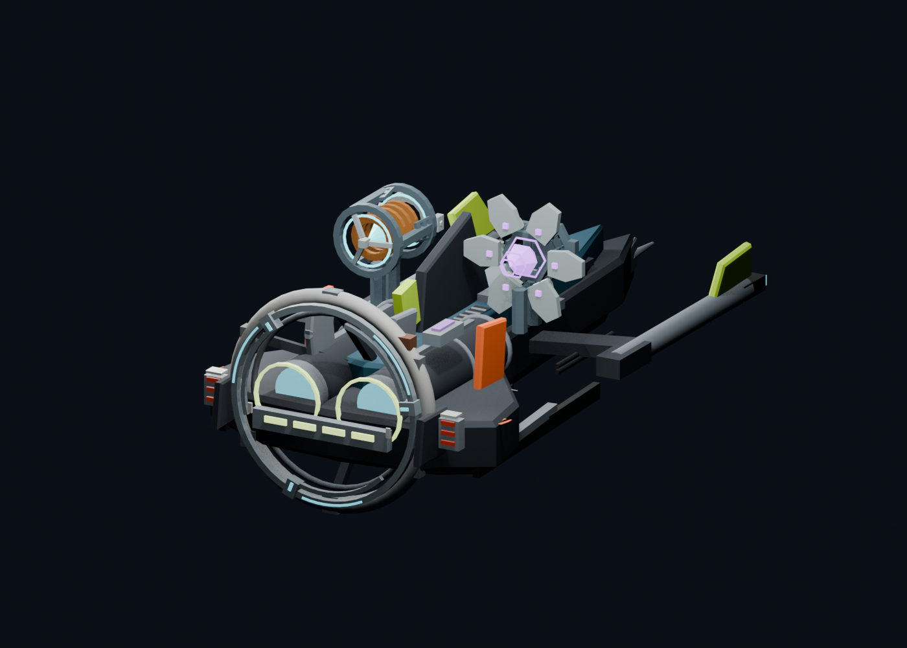

<div align="center">

# FUTURISMA

### Five circuits. A changing tide. One more clean lap.

**A futuristic hover racer with an early-2000s console soul.**

Rain-soaked cities, drowned reactors, sodium-lit pumpworks and a changing tide.<br>
Read the road, choose your line, and make the boost count.

[Start racing](#start-racing) · [Explore the circuits](#five-circuits-five-identities) · [Learn the controls](#controls) · [Inside the workshop](#built-in-blender)



*Three.js · TypeScript · Vite · Blender · atmospheric jungle · no account required*

</div>

## Five circuits, five identities

| Circuit | The atmosphere | The racing idea |
|---|---|---|
| **01 · Greenwater Strip** | A humid wetland airfield: hangars, canopy passages and standing water. | Tight lines and a passing squall that changes grip. |
| **02 · Bitterpan Works** | A salt harvest at noon: brine flats, conveyors, heat and distant machinery. | An exposed deck with visible gusts and salt patches. |
| **03 · Night Shift** | Meridian at 02:17: neon motels, closed arcades, apartment towers and rain. | A roughly 1.96 km city circuit through six districts and an expressway underpass. |
| **04 · Polarity** | A magnetic interchange: power halls, inverter rings and another road 22 metres above. | Optional gravity transfers, narrower express routes and a choice between distance and recharge. |
| **05 · Tideline** | Drowned reactors, painted industrial steel, damp concrete and caged sodium lamps. | A 2.07 km road circuit: flooded on lap one, slick on lap two, with a shorter pump-hall route opening on lap three. |

<table>
<tr>
<td width="50%"></td>
<td width="50%"></td>
</tr>
<tr>
<td><b>Where it began.</b> Greenwater's airfield and weathered racing deck.</td>
<td><b>The Foundry workshop.</b> A Blender asset preview: repaired concrete feet, parallel steel trusses and three working lamps.</td>
</tr>
</table>

## Start racing

Use a current Node.js release with TypeScript stripping support, then:

```sh
npm install
npm run dev
```

Open the address Vite prints. Choose your circuit, format, rival field and livery, then press **Enter**. Append `?map=tideline` for the rebuilt pumpworks. Older `edition=foundry` links open the same circuit. Choose the default three-lap race to experience the whole tide cycle.

| Format | Your objective |
|---|---|
| **Field race** | Complete the circuit's default laps against three rivals. |
| **Sprint** | Defend your lead for two laps with the field starting behind you. |
| **Time attack** | Chase your best lap with a ghost and live gate deltas. Polarity and Tideline currently keep records without a ghost. |

**Rookie → Works → Feral** selects progressively faster authored rival pace. Rivals never rubber-band to your speed. They contest lines, boost and drift; an air cushion handles close contact without a hard vehicle collision.

Circuit choice, settings, liveries, records and supported ghosts are saved locally in your browser.

## Controls

| Action | Keyboard | Gamepad |
|---|---|---|
| Thrust / brake | `W` / `S` or arrows | Triggers |
| Steer | `A` / `D` or arrows | Left stick |
| Drift | Brake + steer at speed | Brake + steer |
| Nitro, every circuit | `Shift` | A |
| Gravity transfer, Polarity junctions | `Space` | X |
| Nitro, other circuits | `Space` or `Shift` | A |
| Deploy power, Polarity and Tideline | `E` | B |
| Recover to last gate | `R` | Y |
| Pause | `Esc` or `P` | Start |
| Mute | `M` | Back |

### Fast lines reward practice

**Commit to a road.** Polarity's lower deck is wider, recharges faster and supplies full-charge devices. The upper deck offers shorter, narrower express routes with slower recharge and 65%-charge devices. Transfers happen at four marked entry/exit windows, with six seconds between transfer starts. Staying on the lower road is a complete racing route. Reduced-motion mode hides the deck change behind a brief opaque transition instead of rolling the camera.

**Learn the tide.** Tideline publishes its schedule before the start and on the HUD. Lap one floods the reactor and lights a current lane with **1.85× nitro recharge**. Lap two lowers the water, exposing slick algae; the worn center line has more grip than the edges. Lap three drains the pump hall and opens a **20 m wide shortcut that saves 23 m**. The main road remains available. The camera stays upright throughout.

| Lap | Water and sound | Your decision |
|---|---|---|
| **01 · Flooded** | Hull creaks, submerged machinery, moving water. | Harvest the lit current for reserve. |
| **02 · Ebb** | Drain siren, rising pump throb, lamps emerging from the water. | Brake early on exposed algae or hold the cleaner center. |
| **03 · Drained** | Open sluices, drips, pump steam and sodium light. | Commit to the narrower pump hall or take the wider main road. |

**Choose your moment.** Carry one device and deploy it when it helps. Surge adds thrust; triggering it inside a painted launch window earns extra duration. Phase Shield absorbs phase fields, with an early timed absorption returning more nitro. Supplies vary by seed and lap, while the course stays learnable.

**Build reserve.** Slipstream rivals, cash a drift, hit gates cleanly and make close passes. The vehicle's rotating rear turbine, engine cores, lights and mounted devices show speed, nitro and power state.

## Built in Blender



The ship's power kit uses modeled turbine housings, projector arms and mechanical mounts. Deployment, exhaust and shield effects animate in the game. Night Shift, Polarity and Tideline include authored Blender scenery.

The Tideline landmarks follow a reference-first production sequence:

**Front / side / top sheet → hero view → material-ID pass → painted 1024 atlases → Blender geometry → side-by-side game render.**

The generated sheets establish silhouette and wear; measured geometry resolves perspective and scale inconsistencies. Each of the six material roles has a painted 1024 atlas carrying stains, rust, baked shading and wear. Vertex colors only tint the surface. Repeated modules have three wear variants, including damage; every fourth surviving tunnel bay is structural, with caged lamps. Two ribs are broken, crown pipes run overhead, and cables sag between bays. World signs carry small place names and fleet numbers; instructions stay on the HUD. The editable scenes, build scripts and reference provenance live under [`art/`](art/).

[Painted-art handoff](docs/visual-polish/TIDELINE-FOUNDRY.md) · [Gantry reference sheets](art/references/tideline-foundry/HANDOFF.md) · [Tideline course notes](docs/visual-polish/TIDELINE.md) · [Gravity and powers](docs/visual-polish/POLARITY.md)

## Sound after midnight

**Meridian Afterimage** is the included original 174 BPM atmospheric jungle instrumental: pads, percussion and bass, with no third-party samples. Sector ambience adds machinery, rain, water, electrical hum and wind. Tideline also adds hull creaks, drainage sirens and pumps that grow louder as the water falls; underwater sections soften the engine. Pit radio calls gates, weather and race position.

Music shares one **MUSIC LEVEL** control with pause, mute and radio ducking. A fresh clone plays the original track. The procedural score remains available with `?music=synth` and as a fallback.

### Bring your own mixes

```sh
node scripts/music-import.mjs <youtube-url-or-audio-file> --title "Artist · Mix name"
node scripts/music-import.mjs --list
node scripts/music-import.mjs --remove mix-slug
```

Imported recordings are loudness-matched and stored in the gitignored `public/assets/audio/music/` directory. The code gate rejects staged or tracked recordings from that folder. The development library includes Peter Lix's *Jungle Classics 1994–1998* and Rob Playford's *Blueprint (1997)*; these private recordings are **not included in a clone**. Mixes longer than five minutes start at a random position each launch.

The original track and its measured provenance live in [`public/assets/audio/original/`](public/assets/audio/original/). Rebuild it with `python3 scripts/build-original-soundtrack.py` using NumPy and ffmpeg.

## Tune your run

Append these to the local game URL, combining options with `&`.

| Option | Result |
|---|---|
| `?map=greenwater`, `bitterpan`, `nightshift`, `polarity`, `tideline` | Select a circuit. |
| `?map=tideline&edition=foundry` | Compatibility link to the rebuilt Tideline. |
| `?mode=race`, `sprint`, `timeattack` | Select the format. |
| `?tier=rookie`, `works`, `feral` | Select rival pace. |
| `?laps=1`…`9` | Set race length; sprint remains two laps. |
| `?seed=714` | Repeat the power supply and route-choice pattern. |
| `?demo=1` | Autopilot showcase; driving input returns control to you. |
| `?motion=reduce` | Reduce decorative motion and gravity-roll effects. |
| `?quality=low` / `high` | Lock the render scale. |
| `?render=ps2` | Console-era raster treatment without shadows. |
| `?music=synth` / `?music=0` | Use the procedural score / silence music. |
| `?voice=0` | Silence pit radio without downloading it. |
| `?diagnostics=1` | Show telemetry for local performance checks. |

Additional QA probes and rendering switches are documented in [Provenance](docs/PROVENANCE.md).

## Development and verification

```sh
npm run test:code   # code and asset validators, TypeScript, production build and budgets
npm test            # the same checks plus accepted art-package archive audits
```

The code gate covers all five circuits, 3D projections, gravity junctions, power timing and replay, rival determinism, scenery clearance, camera behavior, resource cleanup, saves, audio and build budgets. Archive audits additionally need the accepted art packages resolved by `scripts/lib/archive-root.mjs`.

The code gate includes the tide schedule, both physical routes, exposed-surface grip, pause/reset, minimap paths, painted asset contracts and resource cleanup. Exact browser conditions and local performance measurements are recorded in the course notes; they are not a cross-device guarantee.

**Multiplayer status:** racing is currently local against AI or recorded ghosts. Powers have a deterministic simulation with replay and validated snapshots; the tide uses a published schedule driven by the same fixed tick clock, documented in the [ability protocol](docs/visual-polish/ABILITY_PROTOCOL.md). Online sessions and networked racing are not implemented.

| Read more | Contents |
|---|---|
| [Product](PRODUCT.md) | The racing principles and scope. |
| [Performance baseline](docs/PERFORMANCE_BASELINE.md) | Rendering budgets and measurement method. |
| [Provenance](docs/PROVENANCE.md) | Accepted art, archive hashes and verification notes. |
| [Roadmap](docs/plans/ROADMAP.md) | Earlier development phases. |

<div align="center">

**Learn the current. Hold the line. Time the surge.**

</div>
