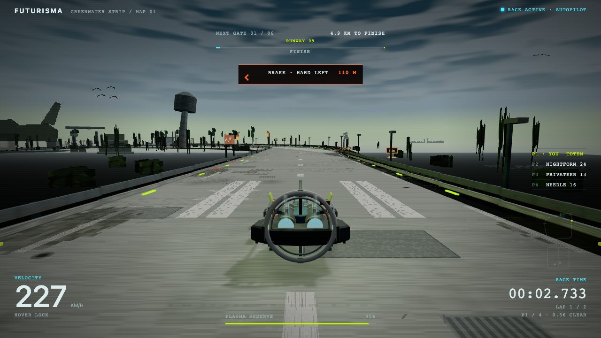

<div align="center">

# FUTURISMA

**An anti-gravity racer that remembers the PS2 without imitating it.**

Hypnotic, technical, feral. Two circuits, four ships, a procedural score, and a world that does things while you race it.


</div>

---

## Play

```sh
npm install
npm run dev
```

Open the URL Vite prints, pick a circuit, a format, a field and a livery in the paddock, press **Enter**.

| Input | Keyboard | Gamepad |
|---|---|---|
| Thrust / brake | `W` `S` or arrows | Triggers |
| Steer | `A` `D` or arrows | Left stick |
| Drift | Brake + steer at speed | Same |
| Boost | `Shift` | A |
| Recover to last gate | `R` | Y |
| Pause | `Esc` or `P` | Start |
| Mute | `M` | Back |

Boost drains a plasma reserve that refills slowly, faster while you sit in a rival's slipstream, and pays out in a lump when you cash a drift. Clear every gate near its centre and the chain multiplies the refill. Pass a rival close and clean and the race pays you for it.

## Two circuits

<table>
<tr>
<td width="50%"></td>
<td width="50%"></td>
</tr>
<tr>
<td><b>Greenwater Strip</b> · Map 01 · a wetland airfield. Humid, overcast, tight. A hangar, a canopy passage, standing water on the Water Table, and a squall that rolls in once a race and takes the grip with it.</td>
<td><b>Bitterpan Works</b> · Map 02 · a salt harvest at noon. Wide, hot, exposed. Wind gusts you can see coming in the dust, salt dropped from a conveyor span, cable coils at the edge of the pan.</td>
</tr>
</table>

## Formats and fields

| Format | What it is |
|---|---|
| **Field race** | Five laps against three rivals |
| **Sprint** | Two laps, the field behind you, defend the lead |
| **Time attack** | Five laps alone against your best lap's ghost, with live gate deltas |

| Field | Pace |
|---|---|
| **Rookie** | The field finishes a few seconds behind a clean run |
| **Works** | Level with you |
| **Feral** | The field is ahead unless you use everything |

Rivals run authored, deterministic pace. They boost, take pads, drift the hard corners and contest lanes, but they never rubber-band and never block the deck. Sit behind one and the slipstream locks; lean on one and an air cushion pushes you both apart without a collision.

Everything you set is remembered locally: livery, circuit, format, field, best laps and your ghosts. There is no account, no server and nothing leaves the browser.

## The world

- **Light.** One sun per sector, real shadows under every structure and under the craft.
- **Sky.** A dome decoupled from the fog, with authored horizon and zenith per sector and a slow cirrus band.
- **Ground.** Bitterpan's pan carries wind streaks and brine flats that converge to the horizon; Greenwater's decks carry runway paint and wear.
- **Air.** Dust, heat, scud and haze cards near the road; mesas, rigs, treelines and pylons at the horizon; birds over Greenwater.
- **Sound.** Everything is synthesised at start: a 174 BPM F-minor score cut by the route, per-sector ambience beds, wind that swells with the gusts, and rivals you can place by ear.

## URL switches

Useful while playing or testing. Combine with `&`.

| Switch | Effect |
|---|---|
| `?map=bitterpan` | Map 02 (default is Greenwater) |
| `?mode=race` `sprint` `timeattack` | Format |
| `?tier=rookie` `works` `feral` | Field |
| `?laps=1`…`9` | Race length (ignored by sprint) |
| `?demo=1` | Autopilot showcase; any input hands control back to you |
| `?diagnostics=1` | Once-a-second telemetry line for performance passes |
| `?quality=low` / `high` | Lock the render scale |
| `?motion=reduce` | The reduced-motion path |
| `?render=ps2` | Era-accurate raster look, no shadows |
| `?events=0` `cushion=0` `shadows=0` `living=0` | Kill switches for track events, the air cushion, shadow maps, the card layer |

QA probes (`?diagnostics=1&probe=recovery` and friends) are listed in [docs/PROVENANCE.md](docs/PROVENANCE.md).

## Verify

```sh
npm run test:code   # every code validator plus the production build
npm test            # the same, then the accepted art-package audits
```

`test:code` needs nothing but the tracked source and is the gate every branch runs. Thirty-odd validators pin the things that are easy to break silently: rival determinism at 60 and 120 Hz, drivable limits derived from the geometry you can see, the atlas orientation of every card, the save-file schema and its migrations, draw-call and gzip budgets, the content-security policy.

Screenshot and soak harnesses live in `scripts/visual/`. They are not shipped.

## Read more

- [docs/PERFORMANCE_BASELINE.md](docs/PERFORMANCE_BASELINE.md) — the frame-time and draw-call budget and how it was measured
- [docs/PROVENANCE.md](docs/PROVENANCE.md) — accepted art freezes, archive hashes, the browser-storage exemption, the full verification notes
- [docs/plans/ROADMAP.md](docs/plans/ROADMAP.md) — how the build was phased
- [PRODUCT.md](PRODUCT.md) — what the game is trying to be, and what it refuses to be

<div align="center">

*Three.js · Vite · TypeScript · zero audio files · zero accounts*

</div>
