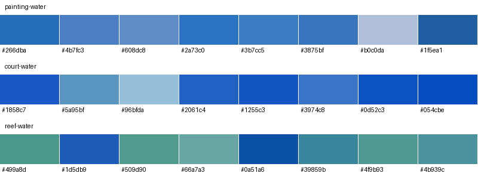

# §8 water revision — uncommitted

**REQUEST CHANGES remains open:** the literal white-glint gate is incompatible with the specified cap and the COURT sun/view geometry. The shader keeps the 1.0 clamp, ≤8° normals, existing sun, tone mapping and fog. No git commit was made. The accepted §5.2–§5.6 implementation is unchanged.

## Constraints and implementation

- Sky response is multiplied by the sampled atlas colour and its normalized hue. This extra pigment tint restores the sea chroma margin spent by the bounded glint. Schlick F0 is 0.02; reflection weight is 0.14 at grazing and 0.0028 at normal incidence, below both corrected caps.
- Four differently directed waves use frequency magnitudes near √½, √2, √3 and √5. Their gradient has a hard norm bound below 0.14: tilt stays below 8°. Blinn exponent 64, gain 4, clamped to 1.0 per colour channel. No texture, triangle or draw is added.
- Wet road uses the smooth geometry normal without perturbation, exponent 8, and a fixed cyan lamp direction. A vertex flag from the existing atlas quadrant excludes all kerb triangles, even though kerbs and road share one material/draw.
- Night sea keeps the requested dark tint. Shallows/foam emission is 12/18 × nightBlend within 80 m, rising smoothly to 64/96 at 160 m. The distant boost preserves the COURT sources through fog while reducing nearby REEF clipping. This is an art-directed distance response, not physical light transport; fog and tone mapping still run normally. The road term stays small. Source-disabled captures suppress only water emission while retaining geometry, diffuse shading, road, camera and sky.

## Measurement method

Brief: `9d7f744`, `work/dream-island-alive`. Captures use the isolated `eafe0b9` tree plus F-3D resources, retaining the accepted AO and excluding concurrent F-CODE work. The documentation-only difference from 9d7f744 does not alter the renderer. Stage 0 retains accepted AO; the original step-0 sea/road pixels are still the numeric reference. Step 3 replays the accepted depth band without revising it.

1280×720, Works, seed 3868938316, COURT .575 / REEF .75, fixed shipped chase pose. `measure.py` still invokes the unchanged grade instrument. The whole-frame columns mean its existing HUD-excluded world band (x 30–97%, y 18–62%). Sea uses exact visible `-sea` isolation pixels inside that same band. Road uses the original exact visible `-road` mask within x 40–75%, y 48–85%. White is BT.709 luma >239; components use eight-neighbour connectivity. FFT is zero-padded (no wraparound), normalized at zero lag, and tests local secondary peaks rather than adjacent samples in the central lobe. An empty white mask scores zero but does **not** satisfy the required white coverage.

The painting is resized once with Lanczos to 1280×720, then sampled with the identical COURT road mask: **painting road p99 = 222.18** (p50 32.14). This is a screen-coordinate comparison, not a claim that the generated painting preserves every road boundary. The original §2 rows and framing caveat remain in the parent report. No REEF painting was supplied.

## Ordered table

Each stage captures both states at both poses and runs both measurement scripts before the next stage is installed. `first-replay/` preserves the insufficient sea-tint trial; the table below is the corrected replay. “AC” is the largest normalized secondary autocorrelation peak.

| Step | Pose/state | World mean | Std | Chroma | p99 | Range | Sea chroma | Sea p50 | Sea white % | Max blob px | Sea AC | Road p50 | Road p99 / painting | Road white % | Road AC |
|---|---|---:|---:|---:|---:|---:|---:|---:|---:|---:|---:|---:|---:|---:|---:|
| 0 | court day | 141.38 | 51.66 | 21.79 | 209.20 | 176.80 | 51.328 | 91.47 | 0.000 | 0 | 0.000 | 108.07 | 123.09 / — | 0.000 | 0.000 |
| 0 | court night | 31.09 | 19.19 | 10.88 | 92.20 | 89.80 | 9.164 | 14.88 | 0.000 | 0 | 0.000 | 38.94 | 59.07 / 222.18 | 0.000 | 0.000 |
| 0 | reef day | 152.87 | 41.12 | 17.57 | 208.50 | 143.50 | 52.884 | 89.26 | 0.000 | 0 | 0.000 | 108.35 | 122.44 / — | 0.000 | 0.000 |
| 0 | reef night | 40.26 | 40.27 | 10.14 | 178.40 | 178.40 | 8.324 | 13.02 | 0.000 | 0 | 0.000 | 36.86 | 54.92 / — | 0.000 | 0.000 |
| 1 | court day | 141.66 | 51.41 | 21.83 | 209.20 | 176.80 | 51.625 | 94.18 | 0.000 | 0 | 0.000 | 108.07 | 123.09 / — | 0.000 | 0.000 |
| 1 | court night | 31.05 | 19.03 | 10.87 | 90.70 | 88.30 | 9.097 | 14.88 | 0.000 | 0 | 0.000 | 38.94 | 59.07 / 222.18 | 0.000 | 0.000 |
| 1 | reef day | 153.11 | 40.93 | 17.58 | 208.50 | 143.50 | 53.422 | 92.12 | 0.000 | 0 | 0.000 | 108.35 | 122.44 / — | 0.000 | 0.000 |
| 1 | reef night | 39.72 | 39.17 | 10.14 | 175.00 | 175.00 | 8.222 | 12.95 | 0.000 | 0 | 0.000 | 36.86 | 54.92 / — | 0.000 | 0.000 |
| 2 | court day | 141.66 | 51.41 | 21.83 | 209.20 | 176.80 | 51.625 | 94.18 | 0.000 | 0 | 0.000 | 108.07 | 123.09 / — | 0.000 | 0.000 |
| 2 | court night | 31.05 | 19.03 | 10.87 | 90.70 | 88.30 | 9.097 | 14.88 | 0.000 | 0 | 0.000 | 38.94 | 59.07 / 222.18 | 0.000 | 0.000 |
| 2 | reef day | 153.29 | 40.83 | 17.49 | 208.50 | 143.50 | 52.952 | 93.45 | 0.000 | 0 | 0.000 | 108.35 | 122.44 / — | 0.000 | 0.000 |
| 2 | reef night | 39.72 | 39.17 | 10.14 | 175.00 | 175.00 | 8.222 | 12.95 | 0.000 | 0 | 0.000 | 36.86 | 54.92 / — | 0.000 | 0.000 |
| 3 | court day | 141.38 | 51.51 | 21.86 | 209.20 | 176.80 | 51.625 | 94.18 | 0.000 | 0 | 0.000 | 108.07 | 123.09 / — | 0.000 | 0.000 |
| 3 | court night | 31.01 | 18.91 | 10.88 | 89.60 | 87.20 | 9.097 | 14.88 | 0.000 | 0 | 0.000 | 38.94 | 59.07 / 222.18 | 0.000 | 0.000 |
| 3 | reef day | 151.18 | 42.24 | 17.78 | 208.50 | 144.30 | 52.952 | 93.45 | 0.000 | 0 | 0.000 | 108.35 | 122.44 / — | 0.000 | 0.000 |
| 3 | reef night | 39.10 | 38.46 | 10.29 | 174.30 | 174.30 | 8.222 | 12.95 | 0.000 | 0 | 0.000 | 36.86 | 54.92 / — | 0.000 | 0.000 |
| 4 | court day | 141.38 | 51.51 | 21.86 | 209.20 | 176.80 | 51.625 | 94.18 | 0.000 | 0 | 0.000 | 108.07 | 123.09 / — | 0.000 | 0.000 |
| 4 | court night | 33.36 | 24.59 | 10.93 | 152.80 | 150.50 | 8.585 | 14.81 | 0.000 | 0 | 0.000 | 45.38 | 59.50 / 222.18 | 0.000 | 0.000 |
| 4 | reef day | 151.18 | 42.24 | 17.78 | 208.50 | 144.30 | 52.952 | 93.45 | 0.000 | 0 | 0.000 | 108.35 | 122.44 / — | 0.000 | 0.000 |
| 4 | reef night | 49.69 | 62.20 | 9.13 | 239.00 | 239.00 | 7.746 | 12.88 | 0.000 | 0 | 0.000 | 36.93 | 54.92 / — | 0.000 | 0.000 |

## Reference deltas

| COURT state/source | Mean | Std | Chroma | p99 | Range | Black % | White % |
|---|---:|---:|---:|---:|---:|---:|---:|
| day §2 shipped | 132.90 | 52.70 | 19.00 | 207.30 | 190.00 | 0.35 | 0.00 |
| day revised | 141.38 | 51.51 | 21.86 | 209.20 | 176.80 | 0.09 | 0.00 |
| day painting | 117.20 | 47.30 | 22.10 | 219.20 | 192.00 | 0.41 | 0.35 |
| night §2 shipped | 30.40 | 18.10 | 10.70 | 79.10 | 75.60 | 23.30 | 0.00 |
| night revised | 33.36 | 24.59 | 10.93 | 152.80 | 150.50 | 25.29 | 0.00 |
| night painting | 31.00 | 34.90 | 8.90 | 193.50 | 191.50 | 38.90 | 0.06 |

Full grade outputs (including p01, black %, white % and no-sky results) are in each stage’s `measurements.json`; isolation metrics and mask images are beside them.

## Literal gate results

- court day: **UNMET:** railsUnchanged, seaWhite.
- court night: PASS all listed checks.
- reef day: **UNMET:** wholeFrameChroma, seaWhite.
- reef night: PASS all listed checks.

The cap diagnostic applies a glint of 1.0 to every water fragment: sea maximum 212.63, p99 211.92, white coverage 0.00%. It cannot cross 239 even when sparsity is abandoned. `sun-cone-bound.json` independently finds the closest COURT sun half-vector needs a 60.56° normal tilt; the allowed cone is 8°. These are constraints on the requested gate, not a justification to claim it passed.

REEF’s original whole-frame day chroma is 17.58, already below the literal 21.8 floor. The table reports that floor honestly at both poses; it does not silently substitute a different REEF threshold.

## Sky, rails and source attribution

All eight sky comparisons are pixel-identical, including the original step-0 sky. Both night rail isolations and the REEF day rail isolation are pixel-identical. COURT day has one changed pixel at (367,387): RGB (122,122,100) → (123,122,100), also inside the attached rail crop. The strict gate table leaves that daytime rail check unmet; no tolerance is silently substituted. Full results are in `proof.json`.

| Pose | Night p99 with sources | Range with sources | p99 without water emission | Range without water emission |
|---|---:|---:|---:|---:|
| court | 152.8 | 150.5 | 72.2 | 69.9 |
| reef | 239.0 | 239.0 | 72.4 | 72.4 |

The isolated tree has no §4 bollards or capsule placements; this source test attributes the rise to foam/shallows. It makes no claim about combined gameplay or the accepted glow’s contribution.

## Crops

Each sea crop is the original 400×200 rectangle at (0,260), enlarged 2× with nearest-neighbour sampling. It includes the sea strip and adjacent sky/shore because the chase pose does not contain a contiguous 400×200 rectangle of only water. It is a visual context crop, distinct from the world-band metric mask.

Before:


Revised:


Night road:


Rails, isolated crop (400×200 at 90,325, enlarged 2×):


REEF night still has 0.98% whole-frame white coverage (down from 6.08% in the rejected uniform-emission trial); this remaining source brightness is a visual tradeoff, not an additional passed gate.


Updated eight-colour atlas-water comparison:



## Performance and validation

- baseline: 105 draws; 162258 main+shadow triangles; p95 9.00 ms; residual -0.468.
- works: 105 draws; 162258 main+shadow triangles; p95 9.00 ms; residual -3.522.
- rookie: 105 draws; 162258 main+shadow triangles; p95 8.80 ms; residual +2.185.
- feral: 106 draws; 162350 main+shadow triangles; p95 8.50 ms; residual -0.932.
- works-reduced: 103 draws; 161808 main+shadow triangles; p95 9.00 ms; residual -5.444.

Matched Works delta: +0.00 ms. Control retains accepted AO, glow and final emission levels; water/road reflection, glint and the new emission-distance hook are disabled. No F-3D browser captures overlap the timed runs; concurrent work elsewhere on this shared host is uncontrolled.

Build and type check, build ceilings, runtime determinism and painted/corridor validation all pass (`validation.json`). Shell gzip: 282,803 B (276.17 KiB), below 277.5 KiB. Named island lazy JS: 80,421 B, below the prior isolated allowance of 85,820 B (prior measurement 78,018 B + 10%). This does not validate the combined F-CODE JS/CSS pin.

PMREM CPU submission costs (not GPU timer measurements):

- court, blend 0: 112.70 ms; two 128-face PMREM captures, once per scene load.
- court, blend 1: 106.60 ms; two 128-face PMREM captures, once per scene load.
- reef, blend 0: 108.20 ms; two 128-face PMREM captures, once per scene load.
- reef, blend 1: 105.70 ms; two 128-face PMREM captures, once per scene load.

Accepted recipe/glow tail unchanged: True. Build/type and material-walk evidence are stored alongside the timed runs. Combined F-CODE integration remains outside this isolated validation.

## Commands

Run from the project root unless stated otherwise:

```sh
python3 art/evidence/dreamisland-v1/alive/3d/prepare-review.py
node node_modules/vite/bin/vite.js --host 127.0.0.1 --port 5204 # in the isolated tree
python3 art/evidence/dreamisland-v1/alive/3d/ordered-review.py 0 4
python3 art/evidence/dreamisland-v1/alive/3d/review-proof.py
python3 art/evidence/dreamisland-v1/alive/3d/cap-probe.py
python3 art/evidence/dreamisland-v1/alive/3d/sun-cone-bound.py
python3 art/evidence/dreamisland-v1/alive/3d/review-validate.py
python3 art/evidence/dreamisland-v1/alive/3d/review-soaks.py
python3 art/evidence/dreamisland-v1/alive/3d/review-soak-proof.py
python3 art/evidence/dreamisland-v1/alive/3d/palette.py review-8/step-4 review-8
python3 art/evidence/dreamisland-v1/alive/3d/review-report.py
```

`ordered-review.py` expands the exact capture, grade and isolation commands into sequential stages. Stage source snapshots and served-file hashes are retained. The 64/96 everywhere trial in `night-wide-emission/` passed range but produced 6.08% whole-frame white at REEF; it was rejected visually. `night-foam-trial/` preserved nearby shallows but missed COURT range. The final distance response addresses that tradeoff. The cap probe replaces only the bounded glint expression with `1.` in the isolated tree for one capture, then restores it. `autocorrelation.py` is added beside `measure.py`; it is deliberately uncommitted, following “Commit nothing.”

## Numbers first measured in this revision

Sea-band chroma and median against step 0; eight-connected white blob area; normalized secondary autocorrelation; painting road-band p99; road-band percentiles and white fraction; normal-cone geometric bound; everywhere-at-cap glint bound; exact rail-isolation differences; water-emission-disabled night range; matched new shader performance delta.
