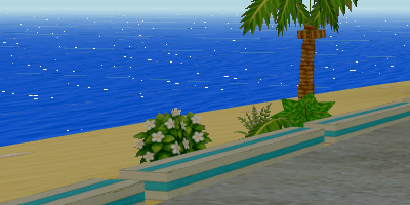
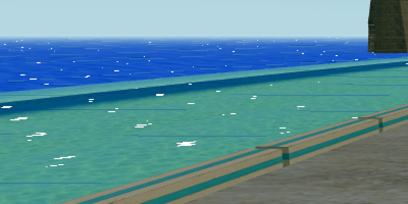
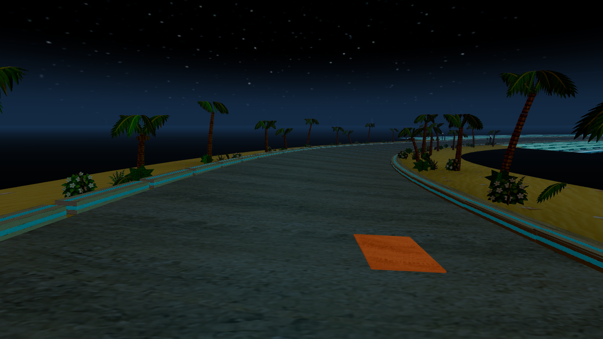
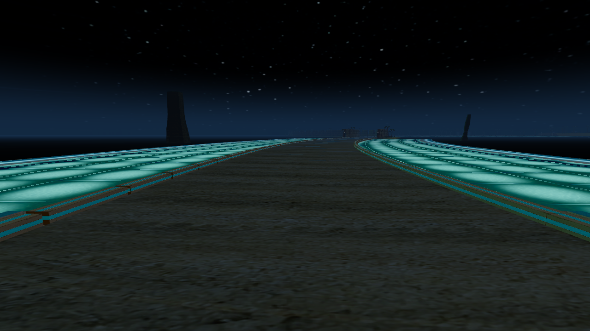
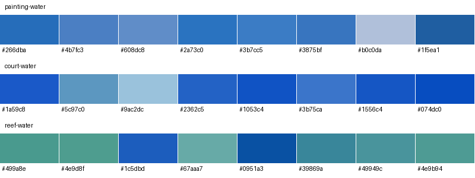

# §9 water revision — uncommitted

**PASS: all isolated §9 water checks.** Timing caveat: Feral first measured 12.2 ms p95, then 9.3 ms on an unchanged-source repeat; both are retained. The combined-build COURT night range is not claimed here. Accepted §5.2–§5.6 work is unchanged. No git commit was made.

## Changes

- The single sparkle-direction uniform is normalized `(0.055479, 0.996917, -0.055479)`: the shadow sun’s +X/−Z azimuth and an art-directed 85.5° elevation. It is shared by both poses. The facet-facing lobe uses exponent 20,000, smoothstep 0.12–0.5 and gain 64; a view-elevation gate fades it between 0.08 and 0.22. This is a painterly normal-facing sparkle, not a physical sun half-vector. Removing its dim fringe preserves the sea cell’s chroma. The accepted four-wave normal field remains bounded below 8°; no lattice texture or extra geometry is introduced.
- Reflection stays tinted by the atlas cell and normalized cell hue, with Schlick F0 0.02. Grazing weight is 0.20 and normal-incidence weight 0.004, within the 0.35/0.08 caps. The small increase from 0.14 leaves chroma room for white facets.
- The 64/96 distance boost and its shader hook are removed. Shallows/foam emission is 1.2/1.5 × nightBlend at every distance. Shallows use cyan `0x48f4ec`; the atlas, fog and tone mapping remain active. The sea retains its dark night tint.
- Accepted smooth-normal road streak, exponent 8 and kerb exclusion are unchanged. The accepted depth band is replayed as step 3. No accepted recipes, GLBs, glow or AO code was revised.

## Measurement method

Brief `216bafe` on `work/dream-island-alive`; isolated `eafe0b9` renderer plus F-3D resources, without concurrent §4 integration. Stage 0 retains the accepted AO and original water recipe. Stage 1 adds reflection; 2 adds glints; 3 replays the accepted depth band; 4 adds the dark night/cyan emission recipe and wet road. Both poses and both states are captured and measured before advancing. Stage snapshots and served-file hashes are retained.

1280×720, Works, seed 3868938316, COURT .575 and REEF .75, fixed shipped chase camera. The unchanged `measure.py` invokes `scripts/visual/grade/measure-frames.py`. Its world band is x30–97%, y18–62%. Sea and shallows use exact visible isolation pixels within that band; road uses x40–75%, y48–85%. The all-water maximum additionally checks the union of visible sea, shallows and foam over the entire frame, including near water outside the grade band. White means BT.709 luma >239. Blob area uses eight-neighbour connectivity. The accepted zero-padded FFT script reports the largest normalized secondary local peak, excluding the central peak. Empty masks score zero but cannot pass the daytime white-coverage floor.

The painting is resized with Lanczos to 1280×720 and sampled using the same COURT road mask: p99 **222.18**. This is a screen-coordinate comparison. No REEF painting was supplied. §2 used a different moving/HUD framing; its rows below remain a reference, while exact per-pose step-0 deltas control acceptance.

## Ordered table

“AC” means the normalized secondary autocorrelation peak. World columns are the grade instrument’s HUD-excluded band.

| Step | Pose/state | Mean | Std | Chroma | p99 | Range | Sea chroma | Sea p50 | Sea white % | Blob px | Sea AC | Road p50 | Road p99 / painting | Road white % | Road AC |
|---|---|---:|---:|---:|---:|---:|---:|---:|---:|---:|---:|---:|---:|---:|---:|
| 0 | court day | 141.38 | 51.66 | 21.79 | 209.20 | 176.80 | 51.328 | 91.47 | 0.000 | 0 | 0.000 | 108.07 | 123.09 / — | 0.000 | 0.000 |
| 0 | court night | 31.09 | 19.19 | 10.88 | 92.20 | 89.80 | 9.164 | 14.88 | 0.000 | 0 | 0.000 | 38.94 | 59.07 / 222.18 | 0.000 | 0.000 |
| 0 | reef day | 152.87 | 41.12 | 17.57 | 208.50 | 143.50 | 52.884 | 89.26 | 0.000 | 0 | 0.000 | 108.35 | 122.44 / — | 0.000 | 0.000 |
| 0 | reef night | 40.26 | 40.27 | 10.14 | 178.40 | 178.40 | 8.324 | 13.02 | 0.000 | 0 | 0.000 | 36.86 | 54.92 / — | 0.000 | 0.000 |
| 1 | court day | 141.78 | 51.31 | 21.84 | 209.20 | 176.80 | 51.738 | 95.32 | 0.000 | 0 | 0.000 | 108.07 | 123.09 / — | 0.000 | 0.000 |
| 1 | court night | 31.03 | 18.95 | 10.87 | 90.10 | 87.70 | 9.065 | 14.88 | 0.000 | 0 | 0.000 | 38.94 | 59.07 / 222.18 | 0.000 | 0.000 |
| 1 | reef day | 153.21 | 40.86 | 17.59 | 208.50 | 143.50 | 53.629 | 93.40 | 0.000 | 0 | 0.000 | 108.35 | 122.44 / — | 0.000 | 0.000 |
| 1 | reef night | 39.48 | 38.67 | 10.15 | 173.50 | 173.50 | 8.187 | 12.95 | 0.000 | 0 | 0.000 | 36.86 | 54.92 / — | 0.000 | 0.000 |
| 2 | court day | 141.87 | 51.35 | 21.81 | 209.50 | 177.00 | 51.503 | 95.61 | 0.234 | 4 | 0.060 | 108.07 | 123.09 / — | 0.000 | 0.000 |
| 2 | court night | 31.03 | 18.95 | 10.87 | 90.10 | 87.70 | 9.065 | 14.88 | 0.000 | 0 | 0.000 | 38.94 | 59.07 / 222.18 | 0.000 | 0.000 |
| 2 | reef day | 153.32 | 40.94 | 17.56 | 208.50 | 143.50 | 53.348 | 93.47 | 0.269 | 5 | 0.125 | 108.35 | 122.44 / — | 0.000 | 0.000 |
| 2 | reef night | 39.48 | 38.67 | 10.15 | 173.50 | 173.50 | 8.187 | 12.95 | 0.000 | 0 | 0.000 | 36.86 | 54.92 / — | 0.000 | 0.000 |
| 3 | court day | 141.59 | 51.45 | 21.85 | 209.50 | 177.00 | 51.503 | 95.61 | 0.234 | 4 | 0.060 | 108.07 | 123.09 / — | 0.000 | 0.000 |
| 3 | court night | 30.99 | 18.84 | 10.88 | 89.00 | 86.60 | 9.065 | 14.88 | 0.000 | 0 | 0.000 | 38.94 | 59.07 / 222.18 | 0.000 | 0.000 |
| 3 | reef day | 151.16 | 42.42 | 17.87 | 208.50 | 144.40 | 53.348 | 93.47 | 0.269 | 5 | 0.125 | 108.35 | 122.44 / — | 0.000 | 0.000 |
| 3 | reef night | 38.86 | 37.97 | 10.29 | 172.80 | 172.80 | 8.187 | 12.95 | 0.000 | 0 | 0.000 | 36.86 | 54.92 / — | 0.000 | 0.000 |
| 4 | court day | 141.59 | 51.45 | 21.85 | 209.50 | 177.00 | 51.503 | 95.61 | 0.234 | 4 | 0.060 | 108.07 | 123.09 / — | 0.000 | 0.000 |
| 4 | court night | 32.22 | 19.42 | 11.09 | 88.90 | 86.60 | 8.585 | 14.81 | 0.000 | 0 | 0.000 | 45.38 | 59.50 / 222.18 | 0.000 | 0.000 |
| 4 | reef day | 151.16 | 42.42 | 17.87 | 208.50 | 144.40 | 53.348 | 93.47 | 0.269 | 5 | 0.125 | 108.35 | 122.44 / — | 0.000 | 0.000 |
| 4 | reef night | 38.84 | 37.92 | 10.29 | 172.60 | 172.60 | 7.746 | 12.88 | 0.000 | 0 | 0.000 | 36.93 | 54.92 / — | 0.000 | 0.000 |

The intermediate REEF step-2 world chroma is 17.56 (0.01 below its floor) before the accepted depth band is restored. Steps 3 and 4 recover to 17.87; final acceptance uses step 4. Sea chroma and sparkle gates pass at both poses from step 2 onward.

## Night water and sources

| Step | Pose | Shallows chroma | Step-0 floor | All-water max luma | All-water white % |
|---|---|---:|---:|---:|---:|
| 0 | court | 19.045 | 19.045 | 166.89 | 0.000 |
| 0 | reef | 22.386 | 22.386 | 194.24 | 0.000 |
| 1 | court | 19.159 | 19.045 | 166.89 | 0.000 |
| 1 | reef | 22.469 | 22.386 | 194.24 | 0.000 |
| 2 | court | 19.159 | 19.045 | 166.89 | 0.000 |
| 2 | reef | 22.469 | 22.386 | 194.24 | 0.000 |
| 3 | court | 19.996 | 19.045 | 166.89 | 0.000 |
| 3 | reef | 23.445 | 22.386 | 194.24 | 0.000 |
| 4 | court | 20.180 | 19.045 | 166.89 | 0.000 |
| 4 | reef | 23.635 | 22.386 | 194.24 | 0.000 |

| Pose | Night p99 with emission | Range | p99 without water emission | Range without |
|---|---:|---:|---:|---:|
| court | 88.9 | 86.6 | 72.2 | 69.9 |
| reef | 172.6 | 172.6 | 72.4 | 72.4 |

**Isolated COURT night p99: 88.9.** This is a reported number, not a gate. The combined build owns the p99 ≥150 / range ≥140 acceptance and must earn it from its bollards, capsule and foam. Those §4 placements are absent here. The counterfactual suppresses only foam/shallows emission, retaining diffuse water, geometry, sky, camera and road.

## Final gate results

- court day: PASS.
- court night: PASS.
- reef day: PASS.
- reef night: PASS.

Per-pose day world-chroma floors: COURT 21.79, REEF 17.57. Sea chroma and median use each pose’s own step 0. Sea white coverage must be 0.15–1.0%, largest blob ≤60 px and AC ≤0.30. Night requires all-water maximum ≤239 and shallows chroma ≥its own step 0. Road keeps p50≥30.9, p99≤the painting, no white and AC≤0.30.

Sky comparisons changed 0 pixels. Rails maximum channel delta: 1; pixels above the §9 two-level tolerance: 0. See `proof.json` for each pose/state.

## Reference deltas

| COURT state/source | Mean | Std | Chroma | p99 | Range | Black % | White % |
|---|---:|---:|---:|---:|---:|---:|---:|
| day §2 shipped | 132.90 | 52.70 | 19.00 | 207.30 | 190.00 | 0.35 | 0.00 |
| day revised | 141.59 | 51.45 | 21.85 | 209.50 | 177.00 | 0.09 | 0.03 |
| day painting | 117.20 | 47.30 | 22.10 | 219.20 | 192.00 | 0.41 | 0.35 |
| day revised − §2 | +8.69 | -1.25 | +2.85 | +2.20 | -13.00 | -0.26 | +0.03 |
| night §2 shipped | 30.40 | 18.10 | 10.70 | 79.10 | 75.60 | 23.30 | 0.00 |
| night revised | 32.22 | 19.42 | 11.09 | 88.90 | 86.60 | 25.30 | 0.00 |
| night painting | 31.00 | 34.90 | 8.90 | 193.50 | 191.50 | 38.90 | 0.06 |
| night revised − §2 | +1.82 | +1.32 | +0.39 | +9.80 | +11.00 | +2.00 | +0.00 |

## Frames and crops

Sea crops are the same 400×200 source rectangle at (0,260), enlarged 2× with nearest-neighbour sampling. They include adjacent sky/shore because neither chase pose contains a contiguous 400×200 sea-only rectangle. These visual crops are distinct from the metric masks.












## Performance and validation

- baseline: 105 draws; 162258 main+shadow triangles; p95 9.00 ms; sampleResidual -1.668.
- works: 105 draws; 162258 main+shadow triangles; p95 8.80 ms; sampleResidual +2.528.
- rookie: 105 draws; 162258 main+shadow triangles; p95 8.70 ms; sampleResidual -0.061.
- feral: 106 draws; 162350 main+shadow triangles; p95 9.30 ms; sampleResidual -0.591.
- works-reduced: 103 draws; 161808 main+shadow triangles; p95 9.90 ms; sampleResidual -10.141.

The first Feral run exceeded the ceiling: 12.20 ms p95, residual -40.190. It is preserved in `soak-feral-first/`. The Feral row above is one unchanged-source repeat after the remaining tier run. A passing repeat does not erase the first result; the cause of the timing variation was not established on this shared host.

Matched Works shader delta: **-0.20 ms**. The control retains accepted resources, geometry and final emission; only water/road reflection and glints are disabled. Runs are sequential with no overlapping F-3D captures or builds. Other activity on the shared host is uncontrolled. `soak-proof.json` records source hashes, errors, material walk, gates and recoveries.

Build/type, build ceilings, runtime determinism and painted/corridor validation: PASS.
Shell gzip 282,801 B (276.17 KiB), ceiling 277.5 KiB. Island lazy JS 80,386 B, retained isolated allowance 85,820 B (prior 78,018 B +10%). Combined F-CODE JS/CSS and gameplay validation remain outside this isolated run.

PMREM CPU submission (not GPU timing), two 128-face captures once per load:

- court, blend 0: 121.20 ms.
- court, blend 1: 111.20 ms.
- reef, blend 0: 127.50 ms.
- reef, blend 1: 116.30 ms.

Accepted recipe/glow tail unchanged: True. Accepted asset hashes are retained in `accepted-inputs.json`; their earlier contracts, atlas proofs, AO topology and 8m/40m views remain in the parent evidence.

## Commands

Run from the project root; the isolated server uses port 5204. `prepare-review.py` reconstructs the isolated eafe0b9 renderer, and the server command runs in that directory.

```sh
python3 art/evidence/dreamisland-v1/alive/3d/prepare-review.py
node node_modules/vite/bin/vite.js --host 127.0.0.1 --port 5204
python3 art/evidence/dreamisland-v1/alive/3d/ordered-review-9.py 0 4
python3 art/evidence/dreamisland-v1/alive/3d/review-9-proof.py
python3 art/evidence/dreamisland-v1/alive/3d/review-9-validate.py
python3 art/evidence/dreamisland-v1/alive/3d/review-9-soaks.py
python3 art/evidence/dreamisland-v1/alive/3d/review-9-soak-proof.py
python3 art/evidence/dreamisland-v1/alive/3d/palette.py review-9/step-4 review-9
python3 art/evidence/dreamisland-v1/alive/3d/review-9-report.py
```

The unchanged-source Feral repeat ran from `/tmp/dreamisland-f3d-eafe0b9`: `node /Users/gentlegen/Desktop/futurisma-race/polarity_work/art/evidence/dreamisland-v1/alive/3d/race.mjs --base=http://127.0.0.1:5204 --tier=feral --out=/Users/gentlegen/Desktop/futurisma-race/polarity_work/art/evidence/dreamisland-v1/alive/3d/review-9/soak-feral`, after preserving the first folder as `soak-feral-first/` and its proof as `soak-proof-first.json`. `review-9-soak-proof.py` and this report generator were then rerun.

`ordered-review-9.py` expands the exact `capture-9.mjs`, unchanged `measure.py` and `measure-9.py` commands for each stage. `trial-1/` through `trial-3/` preserve rejected glint trials and source snapshots. The accepted autocorrelation script remains beside `measure.py`, uncommitted as requested.

## Numbers first measured in this revision

White sparkle coverage at both poses under the single art-directed direction; separate per-pose shallows chroma floors and deltas; maximum luma over all visible water; the revised emission-disabled night result; the §9 rail tolerance proof; refreshed ordered rows and shader timings.
