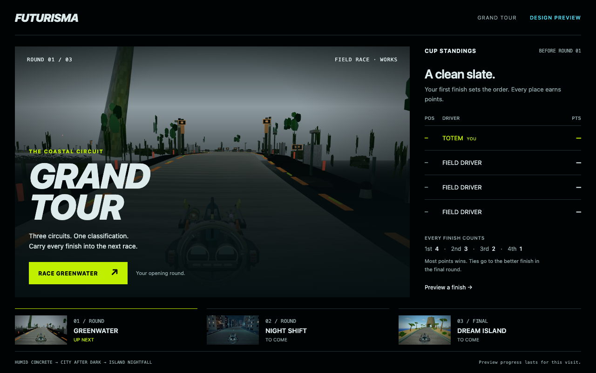
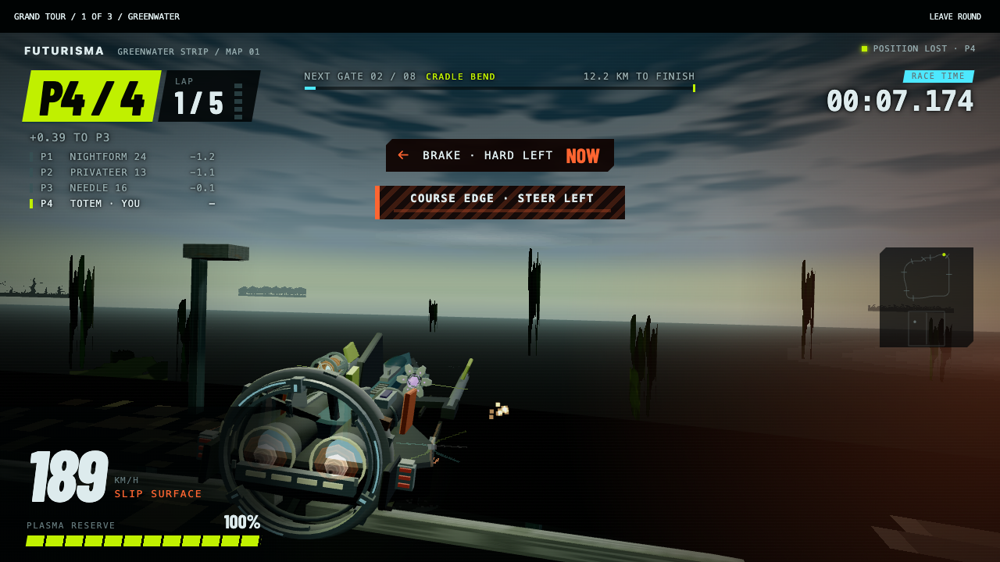
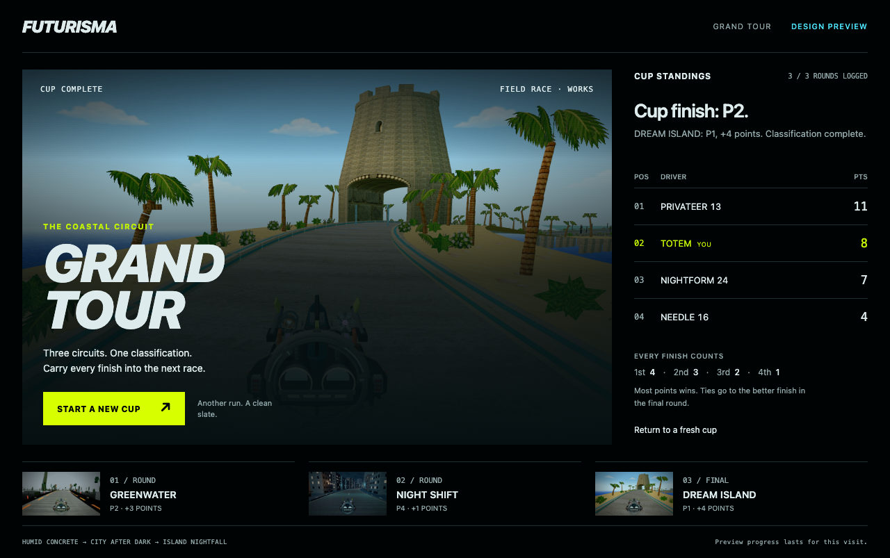

# Grand Tour — playable design preview

**Latest revision:** Claude login is working. Fable 5.1 reviewed the prototype, then reviewed the implemented refinement and confirmed its two main concerns were resolved. See the [refinement report](fable-pass/README.md), [initial critique](fable-review.md) and [follow-up critique](fable-pass/fable-followup.md). The older captures and integration results below remain baseline evidence.

Open [the local preview](http://127.0.0.1:5201/experiments/grand-tour/). Choose **Race Greenwater** for the real game or **Preview a finish** for a clearly labelled sample-results walkthrough. Sample standings cannot be mixed with a played cup. A fresh cup follows Greenwater, Night Shift, then Dream Island at Works tier in Field Race, retaining each course's normal race length and schedule.

## Files added / changed

- `experiments/grand-tour/`: separate development entry, scenic cup menu, responsive styles, score rules and race result adapter. Not referenced by the production entry or copied into `dist`.
- `scripts/visual/grand-tour-review.mjs`: scoring checks, sample/live separation, mobile capture, duplicate-message rejection and real race-to-race verification.
- `scripts/visual/grand-tour-capture-results.mjs`: presentation replay of saved classifications for settled result images.
- `scripts/visual/grand-tour-controls-review.mjs`: keyboard entry, leaving without points, focus restoration, menu contrast and responsive overflow checks.
- This evidence folder, including the [initial Fable review request](fable-review-request.md), completed critiques and refinement evidence.

The previous `neon-environment.ts` optical correction remains the only modified tracked production file. This preview changes no production module. `game.ts` remains frozen at 2,577 lines; controller, route, rival pace, pickup triggers, schedule, shared audio graph and scene materials are untouched.

## What is implemented

The existing game runs in a frame beneath a small cup toolbar. A preview-only entry imports the current game markup and wraps the existing `GameUi.showResult` method before loading `main.ts`. It receives structured classification arguments and forwards them to the cup. It does not scrape result text, alter a lap verdict, or extend the game loop. Each frame has a unique token; the parent accepts a result only from its active frame on the same origin and clears the token before another round can count.

Scores are an **authored prototype rule**: first through fourth receive 4/3/2/1 points. Interim equal scores share a rank; the final round's order breaks a final tie. Driver labels must remain consistent between rounds or the result is rejected. The classification seam currently provides livery labels rather than stable racer IDs; this is a preview limitation to resolve before a durable championship ships. Keep the same livery during this trial.

Cup progress is memory-only and resets on reload. The preview server uses port 5201, separate from the usual 5200 game origin, so ordinary lap records written by these races do not share the usual origin's save. The game still owns its normal settings and records on the preview origin. No permanent championship storage or migration is introduced.

Leaving a round uses a confirmation dialog and awards no points. The game's existing focus-loss behaviour applies while outside its frame. Keyboard/gamepad driving remains the existing game; responsive menu layout is not a claim of touch driving support.

## Numbers this pass measured for the first time

VERIFIED by `node scripts/visual/grand-tour-controls-review.mjs`, saved in `controls.json`:

| Check | Observed result |
|---|---:|
| Horizontal overflow at viewport widths 320 / 768 / 1280 px | 0 / 0 / 0 px |
| Menu primary text on background, WCAG contrast | 16.94:1 |
| Menu secondary text on background, WCAG contrast | 8.39:1 |
| Primary button text on fill, WCAG contrast | 15.48:1 |

Contrast is calculated from the browser's canvas conversion of the existing FUTURISMA colour tokens to sRGB and relative luminance. These measurements apply to the listed solid menu pairs; they are not a full scene, overlay-text or game HUD contrast audit. Menu images are existing game captures with a text scrim; no in-game tint or light level was adjusted. The menu scoring and layout dimensions are authored design choices, not gameplay measurements.

## Budget before / after

VERIFIED by a fresh `npm run build` and `node scripts/validate-build.mjs --out=art/evidence/grand-tour-preview/build`; the before column is the preceding map-polish report. The preview's files are absent from `dist`.

| Production budget | Before | After | Existing ceiling |
|---|---:|---:|---:|
| Initial shell gzip | 283,639 B | 283,639 B | 283,648 B |
| Initial JS gzip | 271,472 B | 271,472 B | 272,384 B |
| Dream Island audio | 225,912 B | 225,912 B | 248,504 B |

This is a development preview, not a shipped championship squeezed into that remaining shell space. No new scene draw/triangle measurement is claimed. Polarity's previously observed draw-budget gap remains open and outside this cup.

## Registration / asset / atlas checklist

No asset or map registration, new atlas consumer, geometry, collision placement, generated image/audio, or Blender output. No new atlas-cell proof is required or claimed. The menu uses saved rendered frames; the race uses the existing live renderer and audio. Screenshots were inspected on desktop and mobile. The previous approved Dream Island plate/core proofs remain applicable to the unchanged map assets.

## Validators and verification limits

Fresh production build and build-budget validation PASS. The controls review PASS covers real keyboard entry, the live race phase, cancelled departure, departure without points, returned focus and menu layout. The first controls harness attempted to click before the loading screen finished; adding a visible-button wait fixed the harness. The first cup harness mistakenly included its synthetic duplicate in its own observed-finish list; source filtering corrected that test bookkeeping.

The full `test:code` suite was not rerun for this separate preview; its preceding production pass is recorded in the map-polish report. There is no new p95, sample residual, collision soak or all-map budget certification in this pass. Race results below are integration evidence, not proof of human fun or handling quality.

## What remains for the next design decision

Play the cup and judge whether an early loss makes the next race more interesting. The baseline immediately replaced the finish screen; the Fable refinement now holds it until Continue. Judge whether that recognition beat works and whether the small cup toolbar earns its screen space.

Fable's two completed reviews are linked above. Its suggestions guide the prototype; they do not establish human fun or handling quality. No Higgsfield generation is needed for this menu prototype. Dream Island E4 remains closed by ruling and reserved for human playtesting. Nothing committed.

## Completed race-to-cup verification

VERIFIED by `node scripts/visual/grand-tour-review.mjs`: the complete cup ran on the existing autopilot, with normal course lengths and no physics or schedule override. Scoring, sample/live separation, duplicate-message rejection and starting a fresh cup PASS; no page errors were recorded. These are automated integration runs, not human playtests. The separate three-way final-tie fixture also PASS (`tie-check.json`).

| Map | Laps | Race elapsed, ms (rounded) | Player finish | Cup points earned |
|---|---:|---:|---:|---:|
| greenwater | 5 | 165716.667 | P2 | 3 |
| nightshift | 3 | 92591.667 | P4 | 1 |
| dreamisland | 3 | 97208.333 | P1 | 4 |

The player finished the cup P2 with 8 points; PRIVATEER 13 won with 11. Full classifications and lap times are in `review.json`. Missed gates, recovery counts, frame percentiles and reconciled sample counts were not collected by this integration instrument; this table is not a performance soak.

The first result captures exposed missing menu text after hiding and restoring its layout around the race. Keeping the menu painted beneath the opaque race view, with `inert` blocking focus and interaction, fixed the reproduced repaint issue. The final `*-cup-result-settled.png` images verify this correction by replaying the saved real classifications through the same adapter. Their provenance is in `capture-provenance.json`; they are presentation captures, not additional race runs. Keyboard entry, leaving and focus restoration were rerun after this presentation-only fix. The original live-run screenshots remain alongside them as before-fix evidence.

