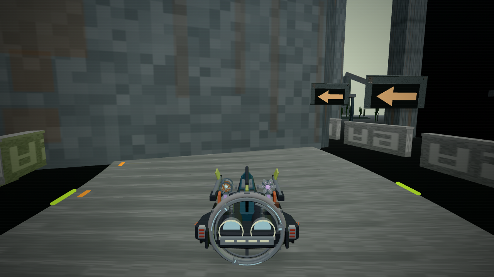
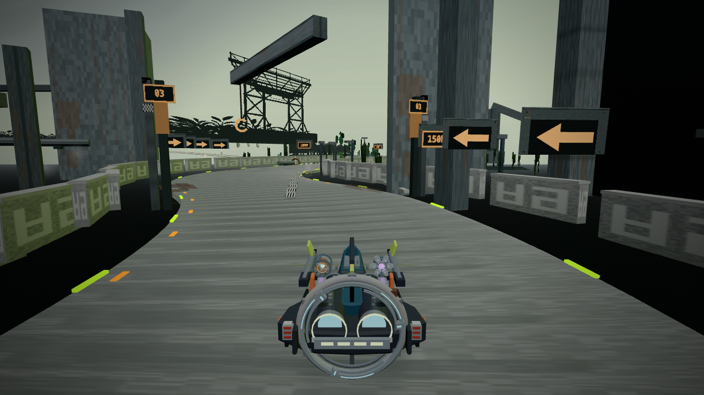
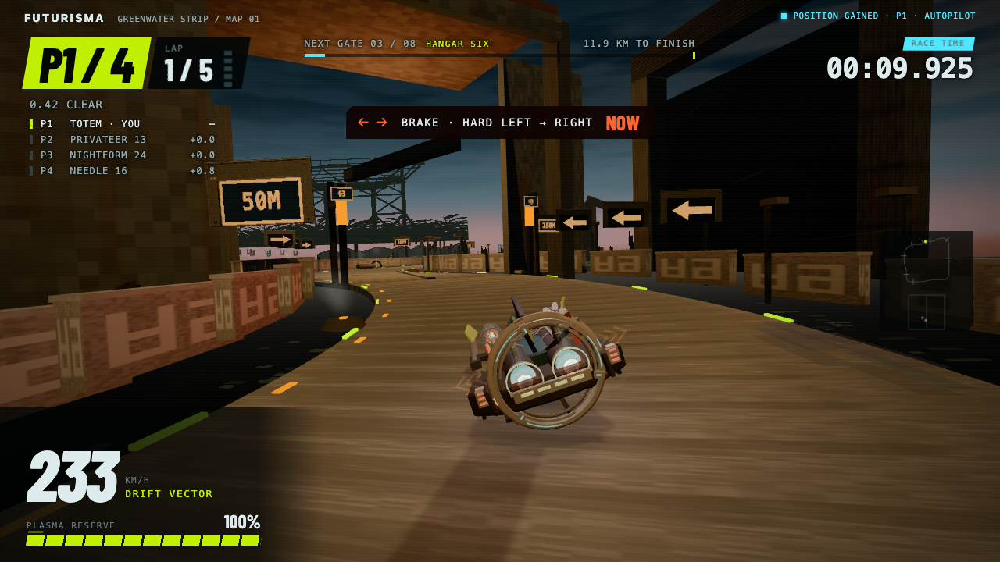

# Greenwater — Hangar Six road obstruction

VERIFIED: the user's screenshot shows a real scenery defect. The first bay wall of `GW_SECTOR_HANGAR_SIX_metal` crosses the road around 694 m. The craft could pass through it because scenery geometry does not define this section's driving physics. The Grand Tour review did not certify road clearance and should not have been presented as resolving this issue.

## Cause and repair

The old corridor census examines mesh vertices. This large panel's corners stand outside the driving corridor, while the face between them cuts across it. The recorded live control reports zero corridor intrusions while direct triangle rays hit the wall on every tested lane. The earlier low-prop and edge-barrier repairs cannot repair that case.

The first bay is now an opening. Its existing wall becomes an overhead lintel, using the underside height of the accepted hangar-mouth module. The roof, ribs, adjoining bays, material, texture and triangle indices remain. The vertical UVs are cropped along their existing atlas edges, preserving the cell instead of squeezing a whole wall texture into the lintel. No controller, route, pace, schedule, collision clamp or game loop change.

## Files added / changed

- `src/game/greenwater-hangar-opening.js`: guarded repair of the accepted panel, performed before the environment enters the scene.
- `src/game/environment.ts`: apply that repair to the Hangar metal mesh during the existing lazy environment load.
- `scripts/validate-hangar-opening.mjs`: reproduce the wall-face failure from the accepted GLB, apply the real repair, and assert clearance, exact edit scope and UV containment.
- `scripts/validate-corridor.mjs`: include the new face regression in the normal code suite, alongside the existing census assertions.
- `scripts/visual/hangar-{road-review,face-probe,race-review}.mjs`: rendered views, actual runtime triangle scan and full-race verification.
- This evidence folder. The earlier `neon-environment.ts` and Grand Tour work is preserved. Nothing committed.

## Numbers this pass measured for the first time

VERIFIED by `node scripts/validate-hangar-opening.mjs`, saved in [validator/opening.json](validator/opening.json):

| Focused bay-panel test | Before | After |
|---|---:|---:|
| Triangle intersections across the road | 164 | 0 |
| Rays, same authored 680–710 m station segment | 2,340 | 2,340 |
| Changed position vertices | — | 12 |
| Changed UV vertices, retained within original atlas edges | — | 8 |
| Triangle index changes | — | 0 |

The repaired lower edge is world Y 24.3 m. This is reused asset geometry, not a newly invented clearance target: accepted `GW_MOD_structure_hangar_mouth_lintel` centre 25.4 m minus half-height 1.6 m, plus its placement Y 0.5 m. The original bay panel spans Y 0.5–26.5 m. Source values were read from the GLB accessors/transforms in `artifacts/GREENWATER_ENVIRONMENT_v1.0.zip` and the served runtime GLB.

VERIFIED by `node scripts/visual/hangar-face-probe.mjs --out=art/evidence/hangar-road/after`, saved in [after/face-probe.json](after/face-probe.json): 4,680 longitudinal rays across the full 19 m road at 0.5 m lateral spacing, four heights, and 1 m longitudinal spacing over 680–710 m find **zero environment-face hits**. This tests all runtime environment meshes after the existing relocations, not only the repaired panel. The existing drivable sweep also ran: 137 meshes, 155,716 tested vertices, zero intrusions; the pre-existing 49 relocations remain.

The initial exploratory control used a coarser five-lane scan over 580–850 m. Its 20 Hangar wall hits are in [before/face-probe.json](before/face-probe.json); other returned faces are sloping deck surfaces at the exit. Its ray count is not directly comparable to the denser final scan. The focused validator provides the identical before/after comparison.

## Budget before / after

VERIFIED by `scripts/visual/hangar-road-review.mjs` at matched static viewpoints, recorded in the before/after `review.json` files. These are main-pass diagnostics counts; shadow totals are not inferred from them.

| Road distance | Main draws before / after | Main triangles before / after |
|---|---:|---:|
| 660 m | 102 / 102 | 62,070 / 62,070 |
| 680 m | 104 / 104 | 62,122 / 62,122 |
| 710 m | 104 / 104 | 61,964 / 61,964 |

VERIFIED by `npm run build` and `node scripts/validate-build.mjs --out=art/evidence/hangar-road/build`:

| Production budget | Previous pass | This pass | Existing ceiling |
|---|---:|---:|---:|
| Initial shell gzip | 283,639 B | 283,641 B | 283,648 B |
| Initial JS gzip | 271,472 B | 271,473 B | 272,384 B |
| Initial JS raw | 994,693 B | 994,693 B | Validator PASS |
| Dream Island audio | 225,912 B | 225,912 B | 248,504 B |

The repair stays in the lazy environment chunk. The tiny initial gzip change accompanies changed chunk references; initial raw JS is unchanged. See [build/build.json](build/build.json).

The new full Greenwater field-race instrument measured 113 peak main calls, 39 peak shadow calls and **148 peak combined calls against the existing 145-call ceiling**. Main triangles peaked at 76,416 (below 220,000); combined triangles peaked at 127,158. The complete-race before value was not captured, so no full-race before/after improvement or budget pass is claimed. The matched views above retain identical counts. This render-budget gap is open; it was not addressed by changing unrelated scenery in the wall repair.

## Registration / asset / atlas checklist

No new mesh, material, texture, registration, AI-generated media or source GLB change. The source asset hash is recorded in the validator. Original normals and indices are byte-identical. All cropped UVs remain on their original vertical atlas edges. The existing render treatment and audio graph are unchanged. The repaired approach and the route beyond it were inspected in rendered screenshots; this is an existing atlas consumer, not a new cell assignment.

## Validators and verification gaps

VERIFIED: full `npm run test:code` PASS with python3/Pillow, including the new regression, existing drivable-limit reproducibility and production build; [test-code.log](test-code.log). `git diff --check` PASS. `game.ts` is unchanged.

VERIFIED by `node scripts/visual/hangar-race-review.mjs`: a full normal-length Greenwater Works field race completed with seed 714 on the existing autopilot. The environment loaded without errors or contract drift. See [race/race.json](race/race.json).

| Laps | Lap times, rounded diagnostics ms | Missed gates | Recoveries | Page errors | Reconciled p95 |
|---|---|---:|---:|---:|---|
| 5 | 34,442 / 32,467 / 32,967 / 32,842 / 33,000 | 0 | 0 | 0 | Not claimed; other verification ran concurrently |

The first capture harness did not acquire the idle renderer's camera until a later render; the final harness installs its camera observer before loading the page. The first live race capture waited for a 20 m window that once-per-second diagnostics can skip at race speed; the capture window was widened without changing gameplay.

UNVERIFIED: a triangle-volume clearance audit of every other map. The existing vertex census retains its known geometric limitation; this pass adds a concrete regression for the reported Hangar face rather than claiming the whole census has become a face-volume solver. Human handling and the existing Dream Island E4 playtest remain outside this repair.
