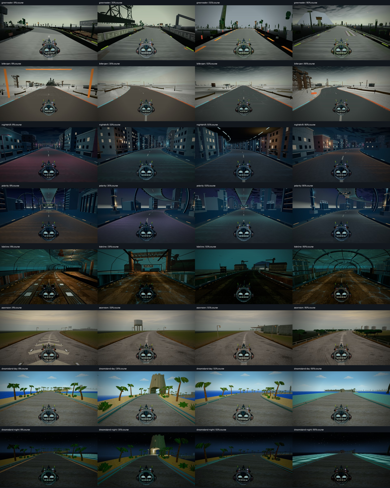
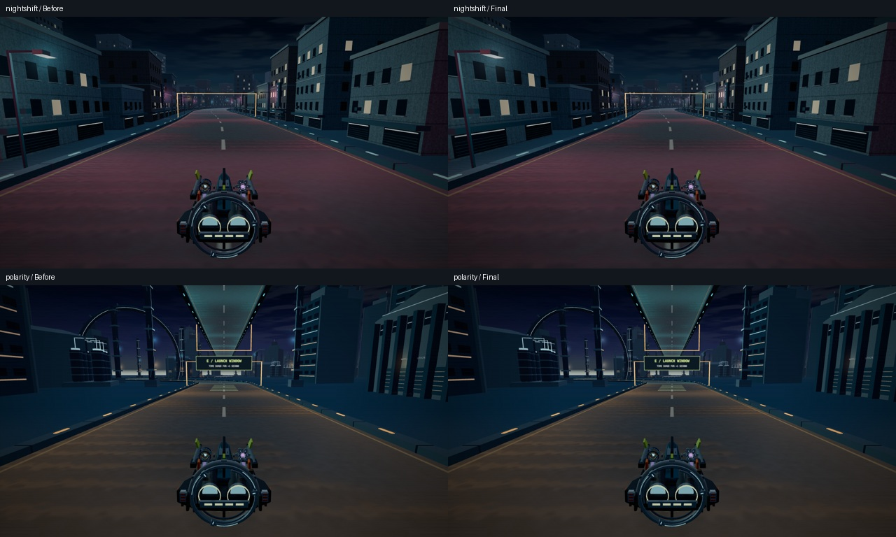

# Map polish follow-up — complete within this pass

A fresh visual review of all seven registered circuits, plus a focused correction to Night Shift and Polarity. This is not blanket final-art approval for every map. The qualitative observations below are based on the saved frames; human playtesting and full event coverage remain separate.

## Files added / changed

- `src/game/neon-environment.ts`: both city optical layers now use the existing shared fog/tone-mapping adapter, loaded lazily before the environment is returned. The custom shader previously had `toneMapped: true` but omitted the tone-mapping chunk; its fog flag and fog chunk were absent.
- `scripts/visual/map-polish-review.mjs`, `neon-optics-review.mjs`, `neon-race-review.mjs`, `map-polish-report.py`: read-only capture, optical comparison, race verification and report tools.
- `art/evidence/map-polish-review/`: frames, comparison, measurements, validation logs and this report.

## Rendered review

VERIFIED loading: all 32 captures resolve the requested map, report the environment ready and record no browser errors. Four requested course positions (8%, 30%, 55%, 80%) per map; Dream Island is sampled with day and night pinned independently. The diagnostics round distance to whole metres; exact requested distances remain in each URL. HUD hidden, shipped image-treatment retained, reduced motion, 1280×720. These are stationary views, not gameplay screenshots at speed.



| Map | Visual judgement from these frames |
|---|---|
| greenwater | Readable road furniture and signage; sparse verges and isolated foliage silhouettes still feel less finished. |
| bitterpan | Salt-pan identity and road edges read clearly; open scenery is intentionally sparse, with limited close landmark detail. |
| nightshift | Coherent street walls and colour cues; repeated façades remain apparent. Glow now obeys the shared render rule. |
| polarity | Overhead road and inverter-ring silhouettes communicate the map; broad ground/building faces remain plain. Glow corrected. |
| tideline | Strong material variation and enclosed industrial views; dark passages still need player legibility feedback. Tide cycle not re-audited here. |
| ascension | Surface markings and infrastructure load correctly; long approaches have broad plain terrain. Launch sequence not re-audited here. |
| dreamisland | Distinct tropical day/night palette and road-edge language; approved POLISH-3 remains intact. Controller feel remains a human-playtest item. |

The survey city frames precede the optical correction; the final comparison below and complete city races verify the changed output. The other maps do not instantiate the corrected optical layers (Tideline explicitly disables them).



## Numbers this pass measured for the first time

VERIFIED by `map-polish-review.mjs`: sampled draw/triangle maxima below include the separately instrumented shadow pass. They are pose samples, never substituted for a worst-tier race ceiling.

| Map/state | Frames | Maximum sampled combined draws | Maximum sampled combined triangles |
|---|---:|---:|---:|
| greenwater | 4 | 105 | 93,666 |
| bitterpan | 4 | 108 | 163,422 |
| nightshift | 4 | 110 | 194,350 |
| polarity | 4 | 122 | 154,151 |
| tideline | 4 | 95 | 146,894 |
| ascension | 4 | 120 | 234,410 |
| dreamisland-day | 4 | 79 | 145,320 |
| dreamisland-night | 4 | 79 | 145,320 |

VERIFIED by `map-polish-report.py` and the existing `grade/measure-frames.py`; luma is BT.709 on the full HUD-free frame, in 0–255 units. No lamp tint, light intensity, opacity, source texture or geometry was tuned. The correction is subtle at these poses.

| Map | Changed pixels | Pixels with channel delta > 8 | Maximum channel delta | Mean luma before → after | Repeat noise / trial-to-shipped difference |
|---|---:|---:|---:|---:|---:|
| nightshift | 75,456 | 3,109 | 80 | 36.92 → 36.88 | 0 / 0 pixels |
| polarity | 16,820 | 1,505 | 58 | 37.17 → 37.15 | 0 / 0 pixels |

## Budget before / after

The before column is the approved POLISH-3 build artifact, not a newly invented baseline. Final values come from `validate-build.mjs --out=art/evidence/map-polish-review/validators`.

| Budget | Approved before | Final | Existing ceiling |
|---|---:|---:|---:|
| Initial JavaScript gzip, B | 271,474 | 271,472 | 272,384 |
| Initial shell gzip, B | 283,642 | 283,639 | 283,648 |
| Dream Island audio, B | 225,912 | 225,912 | 248,504 |

Shell headroom is 9 B. The first static-import attempt failed at 283,654 B; the lazy city-only load passed the unchanged ceiling. Dream Island’s approved worst-tier race remains 105 draws / 162,334 triangles versus 110 / 180,000; this historical race is not claimed as a new soak. No Dream Island runtime or geometry changed.

## Fresh city race checks

VERIFIED by `neon-race-review.mjs`, full default three-lap Works races. The last 720 observed running-render intervals define p95; the separate pre-race 120-interval RAF calibration determines expected samples. Residual = actual samples − expected samples. These local Chrome/Metal timings are not device certification.

| Map | Laps, ms | Missed gates / recoveries | Combined draw / triangle peak | p95, ms | Samples / expected | Residual |
|---|---|---:|---:|---:|---:|---:|
| nightshift | 31767 / 30417 / 30408 | 0 / 0 | 126 / 226,848 | 8.400 | 720 / 713.254 | +6.746 |
| polarity | 27600 / 27792 / 27817 | 0 / 0 | 149 / 183,760 | 8.400 | 720 / 711.199 | +8.801 |

**OPEN: Polarity reached 149 combined draws, above the documented 145-call shadow-enabled scene ceiling (`docs/PERFORMANCE_BASELINE.md`, P20.1).** Its gameplay checks passed; this is not a render-budget pass. The matched optical before/after views have identical main/shadow draw and triangle counts. No pre-change full-city race was captured, so the exact full-race before/after peak is unverified. Resolving the existing scene cost needs a dedicated draw audit, not brighter or newly generated art. The combined triangle totals above include shadow geometry; the historical 220,000 visible-triangle budget was stated for the main pass and is not directly comparable.

## Registration, assets, atlas and collision checklist

- VERIFIED: all seven existing map registrations load; no map or asset registration added.
- VERIFIED: no new atlas consumers, meshes, placements or collision geometry. Existing Dream Island plate/core atlas proofs remain applicable; no new atlas-cell claim is made.
- VERIFIED: only `neon-environment.ts` differs under production source/assets/Blender paths; `protected-hashes.json` checks the frozen game, controller, physics and Dream Island schedule/pickup files against the survey starting revision.
- VERIFIED: the two corrected optical materials per city include shared fog and tone-mapping chunks; instance counts stay 90 per layer in Night Shift and 125 in Polarity.
- No generated images/audio or Blender rebuild. Existing GPT Image 2 reference sheets and Blender build scripts are present for Dream Island, Tideline and Ascension. Image generation can supply modelling references; it is not an automatic image-to-production-mesh conversion. No missing loaded asset required generation in this pass.

## Validators and commands

VERIFIED: baseline and final `npm run test:code` PASS, including Python/Pillow-dependent checks and production build. Ascension course/runtime checks were also run separately because the main suite does not invoke those two checks. Logs are under `validators/`. The transient over-budget attempt is described in the budget section.

```sh
export PATH="$HOME/.nvm/versions/node/v20.19.4/bin:$PATH"
node scripts/visual/map-polish-review.mjs
# Before the production correction:
node scripts/visual/neon-optics-review.mjs
# On the final source:
node scripts/visual/neon-optics-review.mjs --shipped --out=art/evidence/map-polish-review/optics-final
npm run test:code
npm run validate:ascension
npm run validate:ascension-runtime
node scripts/validate-build.mjs --out=art/evidence/map-polish-review/validators
node scripts/visual/neon-race-review.mjs
python3 scripts/visual/map-polish-report.py
git diff --check
```

## Discrepancies, open verification gaps and closure

The request to check other maps does not establish that all maps meet Dream Island’s art contracts. Greenwater/Bitterpan/older city vehicle effects still have pre-existing material exceptions, recorded in `captures.json`; this pass fixes the city scenery optics only. No controller, physics, pace, route, trigger or authored fog-density change was made. E4 remains closed by the user’s ruling: 0.213 s accepted as measured; fog/braking target withdrawn; both belong to human playtesting.

UNVERIFIED: human driving feel, every camera/livery/device, complete launch/tide/night event coverage on all maps, and unaided landmark recognition. The sparse terrain and repeated façades above remain art observations, not silently expanded rebuild tasks. This focused follow-up is done; nothing was committed and no continuing task or automation was created.
