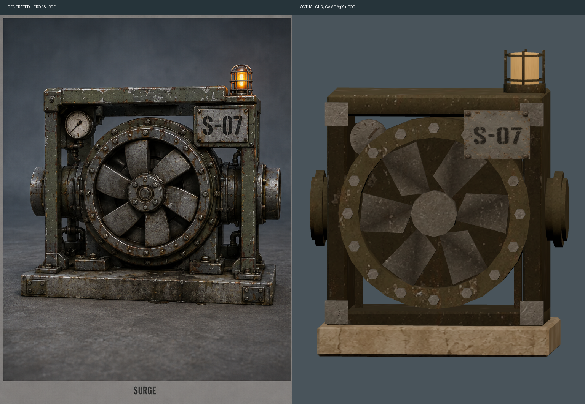

# Tideline V4 — delivery and acceptance evidence

Implemented on `work/tideline-tide`, starting at `054d013`, against [the locked brief](../../../docs/briefs/TIDELINE-V4-POLISH.md). This folder contains saved renders, independent agent reviews, browser recordings and raw measurements. Visual acceptance below comes from images and reviews, not from validators.

[Every saved file and SHA-256](INDEX.md) · [Machine-readable inventory](index.json) · [Race measurements](race-summary.json) · [Full source/build gate](validation/npm-test.log)

## Executed and observed, by package

| Package | Executed | Observed | Interpretation / limits |
|---|---|---|---|
| [D1 — sky](D1.md) | New continuous panorama, fog-colour horizon haze, warm refinery-side world rim and frozen cloud time under reduced motion. | `sky-profile.py` passes the panorama profile. `turntable-profile.py` passes the saved chase-camera sky samples. The source-free [sky review](sky-review-final.md) finds a continuous lighting state, soft clouds and no moon or hard warm/cold split. | It reads as industrial dusk more than strongly blue hour. The broad flare spread is an art judgement; its requested angular span was not physically measured. Native generation was resampled to the delivery size; see provenance below. |
| [D2 — shared rendering](D2.md) | Tideline gameplay meshes use world lighting, fog and AgX. Emission supplies brightness. Actual gantry comparison bay and live material audits added. | The final source-free fog reviews find all supplied families visually compatible with the gantry. `race.mjs` finds **418 material bindings**, all fogged and tone-mapped, in each completed run. | Visual compatibility and material flags are complementary evidence. A reviewer cannot prove shader equivalence from a screenshot. Some gantry parts occlude lower specimen details. |
| [D3 — pump hardware and powers](D3.md) | Native orthographic/hero/material-ID triplet; Blender-authored turbine and iris with painted atlases and preserved pivots. Suspended collecting cradles, worn launch paint, recessed lamps, glass cable trays, physical equipment signs, pressure doors, refraction, klaxon, refund dome, visible rival cues and CHAIN reward. | `validate-power-kit-v2.mjs` measures **3,340 triangles** for both devices. The [refreshed model review](devices/batch-refresh-review.md) names **five shared details per device**. The [final approach review](approaches/final-category-review.md) identifies all four equipment categories. | The models simplify reference depth and wear; beacons are quieter. Approach recognition uses supplied category vocabulary and a reviewer who saw earlier iterations. The signs carry distant identity; tiny subtype and bonus details do not. CHAIN was boundary-tested but did not fire in the ordinary demo. |
| [D4 — port tide](D4.md) | Deep quay foundations, painted waterline/algae bands, exposed ladders/rings, mud shoal, stranded hull and physical gauges following actual water height. | `phases.mjs` captured the final new frames. `score-phases.py` scores the key-blind review **10/10**, including **five port frames**, with **96–99%** stated confidence. | This establishes the supplied chase views, not every possible occluded angle. Earlier failures remain saved. Water stays outside the dry chamber road, visible through its enclosure. |
| [D5 — shortcut and sound](D5.md) | Explicit `demoPumpHall` switch; actual shortcut race frames and browser master-bus audio capture. | `audio.mjs` records the live driver inside the opened hall at all requested stations. `audio-metrics.py` verifies **20 s** of drain audio and **10 s** of hall audio, both non-silent and unclipped. | The hall recording is a stationary listening position with an idling engine and normal audio clock. It is not a slowed/looped race pass. Sound quality has not received an independent listening review. |
| [D6 — world contract and delivery](D6.md) | Manifest regenerated from the actual GLB; loaded census/hash assertions and intentional-drift tests. Batched runtime hardware and deferred setup preserve existing limits. | `validate-tideline-contract.mjs` verifies **74,554 triangles, 55 primitives and 149 unique semantic anchors**; removed crown and flight-lens counts are **zero**. The complete gate passed, with unavailable historical archives explicitly skipped. | Contract checks establish the delivered GLB and loaded counts, not art quality. Missing archive checks remain unverified. |

No route, gate, grip, tide schedule or rival pace was changed. Rival powers are deterministic presentation cues. Other maps continue loading their original power kit and do not call Tideline's render adapter. The shared build changes defer setup and remove build-only HTML comments; they do not change another map's design.

## Acceptance, in the brief's order

1. **Sky profile: pass.** `sky-profile.py` measures the top sky band of the delivered panorama, including circular wrapping: maximum ten-degree warmth delta **0.006224**, below **0.05**, and column luma range **1.120434×**, below **2×**. `turntable.mjs` saves **24** chase views at station three, lap three, and matching sky-only passes. `turntable-profile.py` measures the top sky rows, excluding foreground geometry: worst ratio across a tenth-screen span **1.122848×**. Raw full-world views are preserved alongside those isolated measurements.
2. **Pasted-on test: pass for the supplied views.** `fog.mjs` saves all **ten** families at **45 / 100 / 180 m**. Authoritative reviews: [bulkhead, gate and dome](fog-distance/independent-review-final.md), [refreshed devices, strip and lane](fog-distance/final-refresh-review.md), [final cradle and entrance markers](fog-distance/marker-review.md). The final `race.mjs` material walks have no false fog or tone-mapping flag. Earlier lane occlusion is documented in [the corrected review](fog-distance/lane-review-final.md).
3. **Device match: pass with fidelity qualifications.** `devices.mjs` renders the delivered GLB; `device-comparison.py` puts it beside the generated hero. The independent agent names the required shared details for both devices in [the original](devices/independent-review.md) and [refreshed](devices/batch-refresh-review.md) reviews. These are visible matches, not geometric reconstruction claims.
4. **Repeated blind phase test: pass.** [Final frames and unsealed key](phases-round4/key.json), [review](phases-round4/blind-review.md), [score](phases-round4/score.json). The reviewer received only lettered images, without source or key. `score-phases.py` checks the brief's accuracy, port-frame count and confidence threshold. This was an independent agent review, not a human user study.
5. **Feature categories at speed: pass with stated context.** `approaches.mjs` encodes a **two-second, 300 km/h camera rail** for each actual-world approach. Each saved full-frame poster is **124.444 route-metres** before the target; camera-to-target distances are also recorded in [capture.json](approaches/capture.json). [Final review](approaches/final-category-review.md): launch strip, pickup cradle, phase bulkhead and current cable lane all named correctly using supplied vocabulary, without target coordinates. Cradle confidence is **85%**; the other judgements are **90–95%**. This acceptance item requires category naming; the confidence threshold belongs to the separate phase test. Do not reinterpret this as unaided novice discovery, subtype identification or benefit comprehension.
6. **Determinism: pass.** `race.mjs` captured the untouched starting revision and both final modes at seed **3868938316**. `summarize-races.py` asserts exact equality of all lap times and the complete final classification. Package G did not change the demo outcome.
7. **Budgets: pass on this machine.** Measured values and sample reconciliation are below. `summarize-races.py` asserts the existing shadow-enabled scene ceiling from [PERFORMANCE_BASELINE.md](../../../docs/PERFORMANCE_BASELINE.md), without raising it.
8. **Validators: pass for available inputs.** [The complete `npm test` log](validation/npm-test.log) includes all required Tideline, power-kit and build validators, plus the added hardware, contract and CHAIN checks. Unlike the brief's predicted failure, this checkout's historical archive checks print `SKIP` for unavailable files and the gate exits successfully. Those archives are not verified.
9. **Reduced motion: pass.** The full same-seed run reproduces the baseline outcome. `race.mjs` records **80 live scene samples** after racing starts: stationary cradle/beacon rotations and sky time, uniform door lamps, steady refund-dome states and hidden heat distortion. [Motion audit](reduced-race/motion-audit.json) has no issues. `validate-tideline-hardware.mjs` separately samples animation transitions and verifies the reduced-motion behaviour; the live audit is sampled evidence rather than continuous video analysis.

## Race result and budgets

All values in these tables come from `race.mjs`, reconciled by `summarize-races.py`; raw frames remain in each run's `capture.json`. Chrome runs independently with Metal, a requested high-quality **1280×720** internal buffer and music disabled. No shared Browser pane was controlled. The baseline was an untouched archive of `054d013` on private port `5214`; the working copy used private port `5215`.

| Result | Baseline | Final normal | Final reduced |
|---|---:|---:|---:|
| Lap times, ms | 27,492 / 25,117 / 25,867 | identical | identical |
| Total, ms | 78,475 | 78,475 | 78,475 |
| Finishing order | PRIVATEER 13; NIGHTFORM 24; NEEDLE 16; TOTEM | identical | identical |
| Peak main-pass draws | 112 | 121 | 120 |
| Peak shadow draws | 22 | 22 | 22 |
| Peak combined draws | 134 | 143 | 142 |
| Peak main-pass triangles | 123,242 | 141,816 | 138,496 |
| Peak shadow triangles | 24,456 | 24,456 | 24,456 |
| Peak combined triangles | 147,698 | 166,272 | 162,952 |
| Frame p95, ms | 8.5 | 8.6 | 8.6 |
| Browser errors | 0 | 0 | 0 |

Shadow rendering is measured before Three resets its counters for the main pass. Combined peaks are computed per raw frame, not by adding unrelated maxima. The existing complete-scene limits are **145 draws / 220,000 triangles** (`docs/PERFORMANCE_BASELINE.md`, shadow-enabled amendment); these runs remain inside them. Distant role batching, pivot-preserving device batching and a shared gull mesh pay for the hardware. There is little draw-call headroom left. These local development measurements are not universal hardware certification.

The p95 uses the final rolling sample window, while draw/triangle peaks use the entire captured race. `race.mjs` calibrates the host's actual animation-frame cadence before launch; expected samples = window duration × calibrated rate. `summarize-races.py` retains the difference rather than pretending the host runs at exactly a nominal refresh rate.

| Sample reconciliation | Baseline | Final normal | Final reduced |
|---|---:|---:|---:|
| Full-race captured frames | 9,645 | 9,673 | 9,679 |
| Calibration frames | 120 | 120 | 120 |
| Calibration window, ms | 969.4 | 961.2 | 962.5 |
| Calibrated rate, Hz | 123.7879 | 124.8439 | 124.6753 |
| p95 window, ms | 5,799.5 | 5,812.3 | 5,818.8 |
| Observed samples | 720 | 720 | 720 |
| Expected samples | 717.9080 | 725.6305 | 725.4608 |
| Observed minus expected | +2.0920 | −5.6305 | −5.4608 |

`summarize-races.py` also reports **18 seeded rival power cues**, **nine warning events** and a minimum predicted warning lead of **2.394754 s** in each final run. The warning value is distance/speed evidence that the cue is scheduled early enough, not a listening judgement. It records **zero CHAIN rewards** in these ordinary demo runs. Reward boundaries and single-use behaviour are checked by `validate-tideline-power-chain.mjs`.

## Files, commands and provenance

[INDEX.md](INDEX.md) lists every individual frame, recording, review, script and changed delivered file, its byte size and SHA-256. [index.json](index.json) is the same inventory for tools. Their parent revision identifies the completed implementation/evidence snapshot; they exclude themselves to avoid recursive hashes. Git records the inventory's own final contents.

Run commands from the Polarity copy, with `export PATH=$HOME/.nvm/versions/node/v20.19.4/bin:$PATH` before every Node command. Browser scripts use `browser.mjs`: the local Chrome executable and a Puppeteer installation supplied by `TIDELINE_PUPPETEER` or its documented temporary harness path. Install that harness if reproducing on another machine. Pillow and NumPy support the image/metric scripts; ffmpeg decodes audio and encodes approach clips. Private baseline and working servers must be started separately; do not run multiple GPU captures at the same time.

| Saved output | Script / executed command |
|---|---|
| Native sky candidates, device triplet and painted atlas sources | Native `image_gen.imagegen` calls; exact prompts and source/delivery dimensions in [generation.json](generation.json). Generation is stochastic; it is not expected to reproduce identical pixels. |
| Editable pump kit and GLB | `/Applications/Blender.app/Contents/MacOS/Blender -b --python art/blender/build_power_kit_v2.py` |
| Editable quay/world and GLB | `/Applications/Blender.app/Contents/MacOS/Blender -b --python art/blender/build_tideline.py` |
| Playable manifest | `node scripts/regenerate-tideline-manifest.mjs` |
| Panorama profile | `python3 scripts/visual/tideline-v4/sky-profile.py public/assets/tideline-v4/horizon.jpg art/evidence/tideline-v4/sky-profile.json` |
| `sky-turntable/view-*.png`, matching `sky-*.png`, capture metadata | `node scripts/visual/tideline-v4/turntable.mjs http://127.0.0.1:5215` |
| Turntable profile | `python3 scripts/visual/tideline-v4/turntable-profile.py` |
| `devices/*-idle.png`, `*-active.png`, capture metadata | `node scripts/visual/tideline-v4/devices.mjs` |
| Saved device hero/model comparisons | `python3 scripts/visual/tideline-v4/device-comparison.py` |
| `fog-distance/{specimen}-{distance}.png`, capture metadata | `node scripts/visual/tideline-v4/fog.mjs` |
| `phases-round4/A.png` through `J.png` | `node scripts/visual/tideline-v4/phases.mjs`; private key written to `/tmp/tideline-v4-phase-key.json`, copied to `phases-round4/key.json` only after the reviewer submitted answers. |
| Final blind-phase score | `python3 scripts/visual/tideline-v4/score-phases.py` |
| `approaches/A` through `D`, full-frame PNGs and MP4 bursts | `node scripts/visual/tideline-v4/approaches.mjs`; ffmpeg encoding arguments are explicit in the script. |
| `pump-hall-*.png`, shortcut capture metadata, audio WAV/WebM files | `node scripts/visual/tideline-v4/audio.mjs`; browser MediaRecorder capture and ffmpeg sample trimming are explicit in the script. |
| Audio measurements | `python3 scripts/visual/tideline-v4/audio-metrics.py` |
| Baseline race | `node scripts/visual/tideline-v4/race.mjs http://127.0.0.1:5214 art/evidence/tideline-v4/baseline` against the untouched archive of the starting revision. The later motion/material audits did not exist in this baseline capture. |
| Final normal race | `node scripts/visual/tideline-v4/race.mjs http://127.0.0.1:5215 art/evidence/tideline-v4/final-race --trace` |
| Final reduced race and live motion audit | `node scripts/visual/tideline-v4/race.mjs http://127.0.0.1:5215 art/evidence/tideline-v4/reduced-race --reduced --trace` |
| Reconciled race table | `python3 scripts/visual/tideline-v4/summarize-races.py` |
| `validation/npm-test.log` | `npm test > /tmp/tideline-v4-final-gate.log 2>&1`, then copy the completed log here. Includes `validate:tideline`, `validate:tideline-runtime`, `validate:tideline-environment`, `validate:tideline-foundry`, `validate:power-kit`, `validate:build`, type checking and all registered additional checks. |
| Complete file/hash inventory | `python3 scripts/visual/tideline-v4/evidence-index.py` after committing the implementation, captures and report. |

The review markdown files are qualitative independent-agent observations, not script-produced scores. `score-phases.py` parses the submitted phase answers after the key is unsealed. Feature confidence and five-detail matches are attributed to their named review documents.

Historical evidence is retained: `phases/`, `phases-round2/`, `phases-round3/`, `approaches/round1/`, early approach reviews and the confounded fog frames show failures during iteration. Some intermediate review notes refer to filenames subsequently refreshed; use only the final authority links above to judge current images. `D3-race/` and `normal-trace/` are interim performance captures and are superseded by `final-race/` and `reduced-race/`. Early timed-out browser attempts produced no accepted result. `render-rule/` is the preliminary `smoke.mjs` check, superseded by the completed race's material walk. `approach-candidates.mjs` and `draw-probe.mjs` are retained exploratory framing/cost tools, not acceptance measurements.

Sky and phase screenshots were accepted before later device batching and overhead equipment markers. Their sky shader, water levels, foundation geometry and physical gauge states did not change afterward. Final approach, fog, device and race captures cover the finished hardware. The inventory hashes the actual saved files rather than implying every frame was captured from the final Git commit.

## Open gaps and limits

- The delivered panorama is **4096×1024**, resampled from a native **1774×887** generation (`generation.json` and `sky-profile.py`). It has no native-4K detail claim. The flare span is qualitative, and the final sky review favours “industrial dusk” over a strong blue-hour description.
- Device identities pass their detail test, but the reference's layered mechanical depth, curved iris surfaces, strongly chipped sheet-metal reading and bright caged lamps are only approximated. See `devices/batch-refresh-review.md`.
- Equipment is named at the required distance using the supplied vocabulary, with prior iteration exposure. A completely new player's unaided recognition and understanding of exact rewards remain untested. The cradle is the least confident identification.
- The blind phase result covers the supplied frames. A broad human playtest has not been run, and some distant mud/basin patches still read flat in the sky review.
- Audio files prove capture, timing and non-silence; they have not been independently judged by ear. The warning timing report is predicted arrival lead. No live CHAIN sequence occurred in the normal demo, although its reward logic and boundaries are tested.
- Refraction is a bounded framebuffer-copy distortion through the world shader, not a physically accurate water volume. Reduced-motion evidence samples the live scene and supplements transition checks; it is not a claim about every conceivable camera or interaction.
- Historical asset archives missing from this checkout remain skipped/unverified. Rendering headroom is limited by the existing draw ceiling, and the performance figures describe this local Chrome/Metal run.

Delivery uses the requested branch path: push `work/tideline-tide` to the Polarity copy's local `origin`, then push that branch from `/Users/gentlegen/Desktop/Projects/futurisma-race` to its GitHub `origin`. No force push or merge into `main` is part of this V4 brief.
